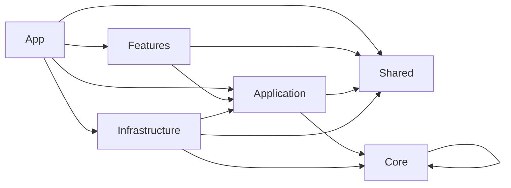
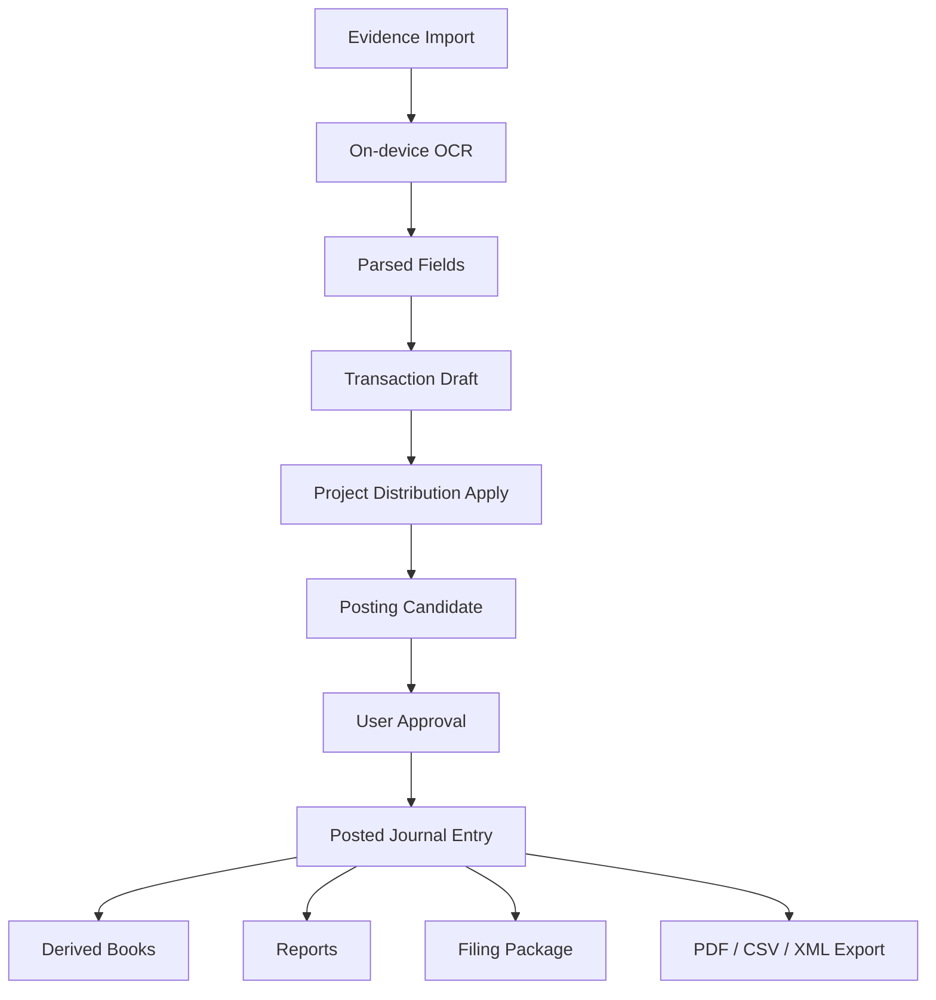
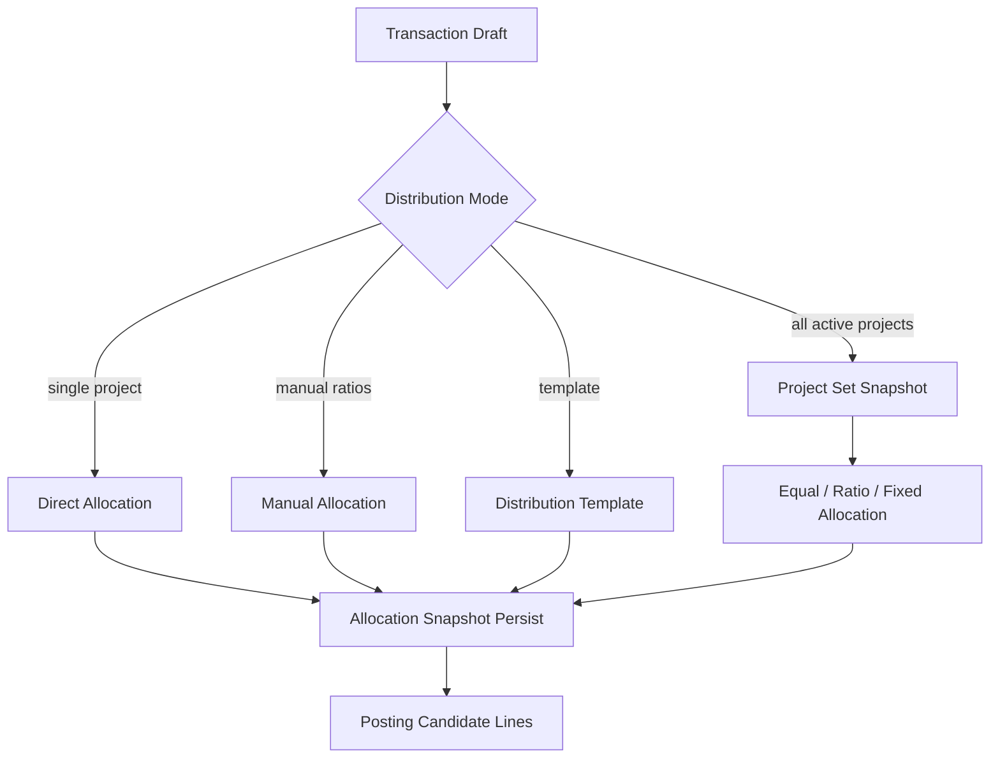
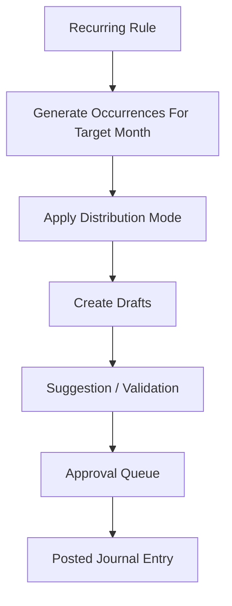

# ProjectProfit 外注先向け詳細アーキテクチャ仕様書
## 新ディレクトリ構成・命名規則・責務分離図・成果物基準・手戻り防止条件付き完全版

作成日: 2026-03-01  
対象プロダクト: `ProjectProfit` iOS アプリ  
対象読者: 外注先PM / テックリード / iOSエンジニア / QA / デザイナー / テスター  
関連資料:
- 既存資料1: `ProjectProfit_Complete_Refactor_Spec.md`
- 既存資料2: `ProjectProfit_Implementation_Task_List.md`
- 添付資料: `青色申告決算書.pdf`
- 添付資料: `収支内訳書.pdf`
- 添付資料: `消費税集計表.png`

---

# 0. この文書の役割

この文書は、外注先が **勝手に再設計して手戻りを起こさない** ための、実装前提の詳細指示書です。  
前回の2文書が「何を作るか」と「どう分解するか」を定義したのに対し、この文書は次を固定します。

1. **新しいディレクトリ構成**
2. **命名規則**
3. **責務分離**
4. **レイヤ依存関係**
5. **既存コードのどこをどう置き換えるか**
6. **何を残し、何を捨て、何を統合するか**
7. **帳簿・帳票・エクスポートの具体フォーマット**
8. **外注先が提出すべき成果物**
9. **検収条件**
10. **解釈の余地を残さない禁止事項**

この文書は、外注先への依頼時に **契約付属の技術仕様書** としてそのまま渡せる粒度で記載しています。

---

# 1. 文書の優先順位

外注先は、設計・実装・QA の判断に迷った場合、以下の優先順位で解釈してください。

1. **国税庁 / e-Tax の現行仕様**
2. **本書**
3. `ProjectProfit_Implementation_Task_List.md`
4. `ProjectProfit_Complete_Refactor_Spec.md`
5. 既存コード
6. 外注先の一般論や過去案件の慣習

重要:
- **既存コードは正ではありません。**
- **既存UIは正ではありません。**
- **既存フォルダ構成は正ではありません。**
- **外注先の都合で命名規則や責務分離を変えてはいけません。**

---

# 2. 絶対に維持するコンセプト

以下は非交渉です。外注先は変更提案してはいけません。

## 2.1 ユーザー像
- 主対象は **個人事業主**
- 会計に詳しくない利用者でも使えること
- ただし帳簿・帳票は **税務実務に耐えるレベル** が必要

## 2.2 プロダクトの核
- **プロジェクトごとに管理できる**
- **会計がノーストレス**
- **証憑起点で自動化される**
- **AIはオンデバイス限定**
- **オフライン中心で使える**
- **青色申告 / 白色申告 / インボイス / 消費税 / 帳簿保存 / e-Tax まで一貫する**

## 2.3 守るべき設計思想
- プロジェクト管理の軸は残す
- ただし申告は **事業者 x 年分** で作る
- プロジェクトは **管理会計 / 配賦軸**
- 法定帳簿・申告書は **年次集約**
- AI は候補提示まで
- 最終税務判定は **ルールエンジン + ユーザー承認**

---

# 3. 外注先向けの重要な前提条件

## 3.1 これは単なるUI改修ではない
この案件は、画面修正案件ではなく **会計システムの全面再設計案件** です。  
表面的に画面を整理するだけでは不合格です。

## 3.2 正本は1系統だけ
今後の正本は必ず次に統一します。

**証憑 -> 取引ドラフト -> 仕訳候補 -> 確定仕訳**

以下はすべて正本ではなく派生です。
- 仕訳帳
- 総勘定元帳
- 現金出納帳
- 預金出納帳
- 経費帳
- 白色用簡易帳簿
- 試算表
- P/L
- B/S
- 収支内訳書
- 青色申告決算書
- 消費税集計表
- PDF
- CSV
- XML
- プロジェクト別損益

## 3.3 DataStore のような巨大状態管理は廃止
UI から直接巨大 `DataStore` を触る設計は禁止です。  
機能単位の画面から巨大ストアへ直接書き込むと、将来の税務整合性が壊れます。

## 3.4 新コードでは `PP` 接頭辞をやめる
既存コードとの互換層では `PP*` が残ってもよいですが、新規の本設計では `PP` 接頭辞を廃止します。  
新しいドメインモデルは自然な名前に統一してください。

例:
- `PPAccountingProfile` -> `BusinessProfile`, `TaxYearProfile`
- `PPTransaction` -> `TransactionDraft` / `JournalEntry`
- `PPDocumentRecord` -> `EvidenceRecord`
- `PPRecurringTransaction` -> `RecurringRule`

## 3.5 `Models.swift` / `Services/` バケツは禁止
外注先は次のような曖昧なバケツフォルダを作ってはいけません。

禁止:
- `Models.swift`
- `Services/` に何でも置く
- `Utils.swift`
- `CommonManager.swift`
- `DataStore2.swift`
- `NewLedgerService.swift`
- `Helper.swift`
- `ExtraViewModel.swift`

責務が曖昧なファイルやフォルダは **即差し戻し対象** です。

---

# 4. 外注先が最初に理解すべき完成形

完成後の `ProjectProfit` は、次の状態に到達していなければなりません。

> 個人事業主が、証憑を取り込み、プロジェクト別の収支を見ながら、勘定科目・税区分・配賦・定期取引・固定資産・棚卸・帳簿・青色申告決算書・収支内訳書・消費税集計表・e-Tax XML まで、端末内で安全に作成できる会計システム。

必須条件:
- プロジェクト別管理が主役
- 証憑を起点に入力負担が減る
- 手入力も強い
- OCR 抽出後の修正がしやすい
- 仕訳候補の承認フローがある
- 単月の全プロジェクト一括配賦がある
- 定期取引の該当月自動分配がある
- ユーザーが勘定科目を追加できる
- ユーザーがジャンルを追加できる
- 勘定科目とジャンルを混同しない
- 法定帳簿と管理会計の両立ができる
- 年分ごとの税制・e-Tax pack が差し替え可能
- オンデバイス AI 以外を使わない

---

# 5. 外注先への禁止事項

以下は禁止です。  
これを行った場合、その実装は完成扱いにしません。

## 5.1 アーキテクチャ上の禁止
- UI から `ModelContext` を直接触る
- SwiftUI View から税務判定を行う
- SwiftUI ViewModel が直接 PDF / CSV / XML を生成する
- 永続モデル `@Model` をドメインモデルとして流通させる
- 会計正本を複数系統持つ
- `LedgerDataStore` 的な第二帳簿世界を作る
- 画面単位で勝手に帳簿定義を持つ
- 税区分や帳票項目をコードにハードコードする
- インボイス有無で帳簿型自体を二重化する
- `Services` フォルダに何でも置く

## 5.2 データ・運用上の禁止
- 証憑をOCR結果だけで保持し、原本ファイルとの紐付けを失う
- ロック後年度の既存仕訳を破壊的更新する
- 帳簿行を手入力で直接編集し、正本仕訳と乖離させる
- 定期取引の履歴を「現在の設定で再計算」して過去月を改変する
- プロジェクト配賦を後から動的再評価して過去実績を変える
- ユーザー追加勘定科目を物理削除する
- 参照中のマスタを物理削除する
- 外部AIへ証憑画像や抽出テキストを送信する
- デバッグ用に証憑画像を外部送信する

## 5.3 UI/UX 上の禁止
- 税務ユーザーに専門用語を説明なしで押し付ける
- 仕訳確定と候補保存を同じ操作にする
- 「保存」だけで税務的確定が走る曖昧な動き
- OCR の誤抽出を修正しづらいUI
- プロジェクト配賦の合計が 100% / 金額一致しない状態を許す
- 年度ロック後に編集可能に見えるUI

---

# 6. ベンダーが読むべき既存コードの位置づけ

既存コードは「参考」であり、「完成形」ではありません。  
ただし、概念として残すべきものはあります。

## 6.1 残す概念
- プロジェクト配賦
- 定期取引
- OCR のオンデバイス化
- 固定資産
- 棚卸
- 年度ロック
- e-Tax / TaxYear pack の考え方
- レシート / 書類保管の土台
- プロジェクト別分析

## 6.2 捨てる構造
- 巨大 `DataStore`
- `Models.swift` に多数モデルを混在
- `LedgerDataStore` と `DataStore` の二重正本
- `Services/` に全責務を混在
- `invoice / non-invoice` の帳簿型二重化
- 税務状態を `Bool` で持つ設計

---

# 7. 既存コードから新設計への差し替え方針

以下の表は、既存コードをどう扱うかを固定するためのものです。  
外注先は勝手に別解釈してはいけません。

| 既存対象 | 方針 | 新しい責務 | コメント |
| --- | --- | --- | --- |
| `ProjectProfit/Services/DataStore.swift` | **分解して廃止** | Repository 実装 + Query Service + UseCase | 巨大ストアは禁止 |
| `ProjectProfit/Models/Models.swift` | **完全分割** | Domain Entity / Persistence Entity / DTO | バケツファイル禁止 |
| `ProjectProfit/Models/PPAccountingProfile.swift` | **置換** | `BusinessProfile`, `TaxYearProfile` | `isBlueReturn: Bool` 廃止 |
| `ProjectProfit/Models/PPDocumentRecord.swift` | **置換** | `EvidenceRecord`, `EvidenceFile`, `EvidenceAuditTrail` | 証憑台帳を本設計へ |
| `ProjectProfit/Models/ConsumptionTaxModels.swift` | **全面置換** | `ConsumptionTaxSummary`, `InvoiceTreatment`, `TaxComputationBasis` | 3項目集計では足りない |
| `ProjectProfit/Services/AccountingEngine.swift` | **全面置換** | `PostingRuleEngine`, `CreatePostingCandidatesUseCase` | 候補生成型へ |
| `ProjectProfit/Services/ConsumptionTaxReportService.swift` | **全面置換** | `ConsumptionTaxEngine`, `BuildConsumptionTaxSummaryUseCase` | 税率別・根拠別へ |
| `ProjectProfit/Services/TaxYearDefinitionLoader.swift` | **考え方のみ継承** | `TaxYearPackProvider` | 年分pack構成へ再設計 |
| `ProjectProfit/Services/EtaxFieldPopulator.swift` | **置換** | `FilingFieldMapper` | 帳票pack依存へ |
| `ProjectProfit/Services/EtaxXtxExporter.swift` | **置換** | `IncomeTaxXmlExporter` | XML / pack / schema分離 |
| `ProjectProfit/Ledger/Services/LedgerDataStore.swift` | **廃止** | 派生帳簿 Query / Export 層へ統合 | 第二正本禁止 |
| `ProjectProfit/Ledger/Services/LedgerExportService.swift` | **統合** | `BookExportService` | 帳簿別 exporter に分解 |
| `ProjectProfit/Ledger/Services/LedgerPDFExportService.swift` | **統合** | `PdfExportFacade` | 集計ロジックはここに置かない |
| `ProjectProfit/Ledger/Services/LedgerExcelExportService.swift` | **統合** | `SpreadsheetExportFacade` | 出力形式責務だけにする |
| `ProjectProfit/Services/PDFExportService.swift` | **統合** | `PdfExportFacade` | 帳票/帳簿/レポート分ける |
| `ProjectProfit/Services/CSVExportService.swift` | **統合** | `CsvExportFacade` | CSV UTF-8 BOM / CP932 option 対応 |
| `ProjectProfit/Services/ReceiptScannerService.swift` | **責務明確化して継承** | `OnDeviceEvidenceScanner` | OCR / 抽出だけに集中 |
| `ProjectProfit/Services/ReceiptImageStore.swift` | **再配置** | `EvidenceFileStore` | 原本保存・ハッシュ・パス管理 |
| `ProjectProfit/Services/ClassificationEngine.swift` | **継承** | `LocalSuggestionEngine` | 候補提示のみ |
| `ProjectProfit/Services/ClassificationLearningService.swift` | **継承** | `LocalCorrectionMemory` | 端末内学習のみ |
| `ProjectProfit/Services/InventoryService.swift` | **継承して整理** | `InventoryValuationEngine` | ドメインへ寄せる |
| `ProjectProfit/Services/DepreciationEngine.swift` | **継承して整理** | `DepreciationRuleEngine` | 年分・税区分対応 |
| `ProjectProfit/ViewModels/*` | **再配置** | Feature ごとの Presentation 層 | ViewModel の責務を縮小 |
| `ProjectProfit/Views/*` | **再配置** | Feature / Shared UI | 機能横断UIを整理 |
| `ProjectProfit/Resources/TaxYear2025.json` | **分割再構成** | `Resources/TaxYearPacks/2025/*` | 1ファイル依存禁止 |
| `master_schema.json` 的な帳簿定義 | **継承して再設計** | `Resources/Templates/Books/*` | 帳簿列定義の外出し継続 |

---

# 8. 新アーキテクチャの完成形

## 8.1 採用するアーキテクチャ
本案件では、**フォルダで分離されたクリーンアーキテクチャ + Feature Presentation 分離** を採用します。

ただし、初回リファクタでは **Xcodeターゲットを過度に分割しません**。  
理由:
- 手戻りを減らすため
- iOS 単体アプリとして移行コストを抑えるため
- まず責務分離と正本一本化を優先するため

よって、初期完成形は **単一アプリターゲット内でフォルダと依存ルールを厳格化** する構成にします。  
将来の Swift Package 分離は optional ですが、今回の受託範囲の必須ではありません。

## 8.2 レイヤ構成
- `App`
- `Shared`
- `Core`
- `Application`
- `Infrastructure`
- `Features`
- `Resources`
- `Tests`
- `Docs`
- `Tools`

---

# 9. 完成後のディレクトリ構成

以下を **そのまま採用** してください。  
階層名を勝手に変えてはいけません。

```text
ProjectProfit/
  App/
    Bootstrap/
      AppBootstrap.swift
      DependencyContainer.swift
      AppEnvironment.swift
    Routing/
      AppRouter.swift
      TabRoute.swift
      SheetRoute.swift
    Lifecycle/
      AppLaunchCoordinator.swift
      BackgroundTaskCoordinator.swift

  Shared/
    Foundation/
      Extensions/
      Formatters/
      Validators/
      DateTime/
      Currency/
      Localization/
      Errors/
      Logging/
    UI/
      Components/
      Styles/
      Modifiers/
      Tokens/
      Accessibility/
    Preview/
      PreviewFixtures/
      PreviewBuilders/

  Core/
    Domain/
      BusinessProfile/
        BusinessProfile.swift
        BusinessProfileRepository.swift
        BusinessName.swift
      TaxYear/
        TaxYearProfile.swift
        FilingStyle.swift
        BookkeepingBasis.swift
        BlueDeductionLevel.swift
        VatStatus.swift
        VatMethod.swift
        InvoiceIssuerStatus.swift
        ElectronicBookLevel.swift
        YearLockPolicy.swift
        TaxYearProfileRepository.swift
      Projects/
        Project.swift
        ProjectStatus.swift
        ProjectGroup.swift
        ProjectRepository.swift
      Distribution/
        DistributionMode.swift
        DistributionAllocation.swift
        DistributionTemplate.swift
        DistributionTemplateRepository.swift
        AllocationCalculator.swift
        AllProjectsDistributionPolicy.swift
        MonthlyDistributionSnapshot.swift
      Accounts/
        Account.swift
        AccountCode.swift
        AccountType.swift
        AccountSubtype.swift
        NormalBalance.swift
        ReportMapping.swift
        ChartOfAccountsRepository.swift
      Categories/
        Category.swift
        CategoryKind.swift
        CategoryGroup.swift
        CategoryRepository.swift
      Counterparties/
        Counterparty.swift
        RegistrationNumber.swift
        LegalEntityNumber.swift
        CounterpartyRepository.swift
      Evidence/
        EvidenceRecord.swift
        EvidenceId.swift
        EvidenceLegalType.swift
        EvidenceSourceType.swift
        EvidenceStorageType.swift
        EvidenceStatus.swift
        EvidenceHash.swift
        EvidenceLineItem.swift
        EvidenceSearchCriteria.swift
        EvidenceRepository.swift
      Transactions/
        TransactionDraft.swift
        TransactionDraftLine.swift
        TransactionDraftStatus.swift
        TransactionDraftRepository.swift
      Posting/
        PostingCandidate.swift
        PostingCandidateLine.swift
        PostingSource.swift
        JournalEntry.swift
        JournalLine.swift
        VoucherNumber.swift
        JournalEntryRepository.swift
      Tax/
        TaxCategory.swift
        InvoiceTreatment.swift
        TaxComputationBasis.swift
        TaxRuleEvidence.swift
        ConsumptionTaxSummary.swift
        ConsumptionTaxBreakdown.swift
        ConsumptionTaxRuleEngine.swift
      FixedAssets/
        FixedAssetRecord.swift
        DepreciationMethod.swift
        FixedAssetStatus.swift
        DepreciationRuleEngine.swift
        FixedAssetRepository.swift
      Inventory/
        InventoryItem.swift
        InventorySnapshot.swift
        InventoryValuationMethod.swift
        InventoryRepository.swift
      Recurring/
        RecurringRule.swift
        RecurringFrequency.swift
        RecurringOccurrence.swift
        RecurringRuleRepository.swift
        OccurrenceGenerationPolicy.swift
      Reporting/
        Reports/
          TrialBalanceReport.swift
          ProfitLossReport.swift
          BalanceSheetReport.swift
          ProjectProfitReport.swift
          ConsumptionTaxReport.swift
        Books/
          JournalBookRow.swift
          GeneralLedgerRow.swift
          CashBookRow.swift
          BankBookRow.swift
          ExpenseLedgerRow.swift
          WhiteBookRow.swift
          EvidenceLedgerRow.swift
      Filing/
        FilingPackage.swift
        FilingField.swift
        FilingReadinessIssue.swift
        FilingPackageRepository.swift
      Audit/
        AuditEvent.swift
        AuditEventType.swift
        AuditRepository.swift

  Application/
    DTOs/
      Requests/
      Responses/
      ViewData/
    UseCases/
      Evidence/
        ImportEvidenceUseCase.swift
        ParseEvidenceUseCase.swift
        CorrectEvidenceUseCase.swift
        LinkEvidenceUseCase.swift
      Drafts/
        CreateDraftFromEvidenceUseCase.swift
        SaveDraftUseCase.swift
        SuggestDraftValuesUseCase.swift
      Posting/
        CreatePostingCandidatesUseCase.swift
        ApprovePostingCandidateUseCase.swift
        PostJournalEntryUseCase.swift
        ReverseJournalEntryUseCase.swift
      Distribution/
        ApplyDistributionTemplateUseCase.swift
        ApplyAllProjectsDistributionUseCase.swift
        SnapshotMonthlyProjectSetUseCase.swift
      Recurring/
        GenerateOccurrencesForMonthUseCase.swift
        ExpandRecurringRulesUseCase.swift
        MaterializeRecurringDraftsUseCase.swift
      Masters/
        CreateAccountUseCase.swift
        UpdateAccountUseCase.swift
        CreateCategoryUseCase.swift
        UpdateCategoryUseCase.swift
        CreateCounterpartyUseCase.swift
        UpdateCounterpartyUseCase.swift
        CreateDistributionTemplateUseCase.swift
      Inventory/
        CloseInventoryForYearUseCase.swift
      FixedAssets/
        RegisterFixedAssetUseCase.swift
        RunDepreciationUseCase.swift
      Closing/
        RunMonthCloseUseCase.swift
        RunYearCloseUseCase.swift
        LockTaxYearUseCase.swift
        UnlockTaxYearUseCase.swift
      Reporting/
        BuildTrialBalanceUseCase.swift
        BuildProfitLossUseCase.swift
        BuildBalanceSheetUseCase.swift
        BuildProjectProfitUseCase.swift
        BuildConsumptionTaxSummaryUseCase.swift
        BuildBookExportDataUseCase.swift
      Filing/
        BuildBlueReturnPackageUseCase.swift
        BuildWhiteReturnPackageUseCase.swift
        BuildConsumptionTaxPackageUseCase.swift
        ValidateFilingReadinessUseCase.swift
    Queries/
      Dashboard/
      Projects/
      Evidence/
      Journals/
      Reports/
      Filing/
    Ports/
      OCR/
        EvidenceOCRPort.swift
      FileStorage/
        EvidenceFileStorePort.swift
      Export/
        PdfExportPort.swift
        CsvExportPort.swift
        XmlExportPort.swift
      TaxYearPack/
        TaxYearPackProviderPort.swift
      Clock/
        ClockPort.swift
      Search/
        EvidenceSearchPort.swift
      SecureStore/
        SecureStorePort.swift
    Mappers/
      EvidenceToDraftMapper.swift
      DraftToPostingCandidateMapper.swift
      JournalToBookRowMapper.swift
      DomainToViewDataMapper.swift

  Infrastructure/
    Persistence/
      SwiftData/
        Entities/
          BusinessProfileEntity.swift
          TaxYearProfileEntity.swift
          ProjectEntity.swift
          DistributionTemplateEntity.swift
          AccountEntity.swift
          CategoryEntity.swift
          CounterpartyEntity.swift
          EvidenceRecordEntity.swift
          TransactionDraftEntity.swift
          PostingCandidateEntity.swift
          JournalEntryEntity.swift
          JournalLineEntity.swift
          FixedAssetEntity.swift
          InventorySnapshotEntity.swift
          RecurringRuleEntity.swift
          AuditEventEntity.swift
        Repositories/
          SwiftDataBusinessProfileRepository.swift
          SwiftDataTaxYearProfileRepository.swift
          SwiftDataProjectRepository.swift
          SwiftDataDistributionTemplateRepository.swift
          SwiftDataChartOfAccountsRepository.swift
          SwiftDataCategoryRepository.swift
          SwiftDataCounterpartyRepository.swift
          SwiftDataEvidenceRepository.swift
          SwiftDataTransactionDraftRepository.swift
          SwiftDataJournalEntryRepository.swift
          SwiftDataFixedAssetRepository.swift
          SwiftDataInventoryRepository.swift
          SwiftDataRecurringRuleRepository.swift
          SwiftDataAuditRepository.swift
        Migrations/
          LegacySchemaVersion.swift
          LegacyDataMigrator.swift
          MigrationReport.swift
        Store/
          SwiftDataStack.swift
          ModelContainerFactory.swift
    OCR/
      Vision/
        VisionTextRecognizer.swift
        VisionDocumentDetector.swift
      OnDeviceExtraction/
        OnDeviceEvidenceScanner.swift
        RegexFallbackExtractor.swift
        LocalSuggestionEngine.swift
        LocalCorrectionMemory.swift
    FileStorage/
      Evidence/
        LocalEvidenceFileStore.swift
        EvidenceFilePathResolver.swift
      Export/
        ExportFileStore.swift
    Export/
      PDF/
        PdfExportFacade.swift
        JournalPdfExporter.swift
        GeneralLedgerPdfExporter.swift
        TrialBalancePdfExporter.swift
        ProfitLossPdfExporter.swift
        BalanceSheetPdfExporter.swift
        WhiteBookPdfExporter.swift
        FilingPreviewPdfExporter.swift
        ConsumptionTaxSummaryPdfExporter.swift
      CSV/
        CsvExportFacade.swift
        JournalCsvExporter.swift
        GeneralLedgerCsvExporter.swift
        CashBookCsvExporter.swift
        BankBookCsvExporter.swift
        ExpenseLedgerCsvExporter.swift
        WhiteBookCsvExporter.swift
        EvidenceLedgerCsvExporter.swift
      XML/
        IncomeTaxXmlExporter.swift
        XmlSchemaValidator.swift
        FilingFieldMapper.swift
    TaxYearPack/
      TaxYearPackProvider.swift
      PackDecoders/
      RuleLoaders/
    Search/
      LocalEvidenceSearchIndex.swift
    Security/
      KeychainSecureStore.swift
      SensitiveExportPreferenceStore.swift
    Logging/
      AuditLogger.swift
    Notifications/
      LocalNotificationScheduler.swift
    Clock/
      SystemClock.swift

  Features/
    Dashboard/
      Presentation/
        Screens/
          DashboardScreen.swift
        Components/
        ViewModels/
          DashboardViewModel.swift

    Projects/
      Presentation/
        Screens/
          ProjectsScreen.swift
          ProjectDetailScreen.swift
          ProjectProfitScreen.swift
        Components/
        ViewModels/
          ProjectsViewModel.swift
          ProjectDetailViewModel.swift

    EvidenceInbox/
      Presentation/
        Screens/
          EvidenceInboxScreen.swift
          EvidenceDetailScreen.swift
          EvidenceCorrectionScreen.swift
        Components/
        ViewModels/
          EvidenceInboxViewModel.swift
          EvidenceDetailViewModel.swift

    Drafts/
      Presentation/
        Screens/
          DraftListScreen.swift
          DraftEditorScreen.swift
        Components/
        ViewModels/
          DraftListViewModel.swift
          DraftEditorViewModel.swift

    ApprovalQueue/
      Presentation/
        Screens/
          ApprovalQueueScreen.swift
          PostingCandidateDetailScreen.swift
        Components/
        ViewModels/
          ApprovalQueueViewModel.swift

    Journals/
      Presentation/
        Screens/
          JournalListScreen.swift
          JournalDetailScreen.swift
          ManualJournalScreen.swift
        Components/
        ViewModels/
          JournalListViewModel.swift
          JournalDetailViewModel.swift

    Recurring/
      Presentation/
        Screens/
          RecurringRulesScreen.swift
          RecurringRuleEditorScreen.swift
          RecurringPreviewScreen.swift
        Components/
        ViewModels/
          RecurringRulesViewModel.swift

    Masters/
      Accounts/
        Presentation/
          Screens/
            AccountsScreen.swift
            AccountEditorScreen.swift
          ViewModels/
      Categories/
        Presentation/
          Screens/
            CategoriesScreen.swift
            CategoryEditorScreen.swift
      Counterparties/
        Presentation/
          Screens/
            CounterpartiesScreen.swift
            CounterpartyEditorScreen.swift
      DistributionTemplates/
        Presentation/
          Screens/
            DistributionTemplatesScreen.swift
            DistributionTemplateEditorScreen.swift

    Reports/
      Presentation/
        Screens/
          TrialBalanceScreen.swift
          ProfitLossScreen.swift
          BalanceSheetScreen.swift
          BooksCenterScreen.swift
          ConsumptionTaxSummaryScreen.swift
        ViewModels/

    Filing/
      Presentation/
        Screens/
          FilingCenterScreen.swift
          BlueReturnPreviewScreen.swift
          WhiteReturnPreviewScreen.swift
          FilingReadinessScreen.swift
          EtaxExportScreen.swift
        ViewModels/

    Settings/
      Presentation/
        Screens/
          SettingsScreen.swift
          BusinessProfileScreen.swift
          TaxYearSettingsScreen.swift
          SecuritySettingsScreen.swift
        ViewModels/

  Resources/
    TaxYearPacks/
      2025/
        profile.json
        account_mappings.json
        filing/
          blue_general_fields.json
          blue_cash_basis_fields.json
          white_fields.json
          common_validations.json
        consumption_tax/
          rates.json
          invoice_treatments.json
          special_rules.json
      2026/
        ...
    Seed/
      chart_of_accounts/
      categories/
      industry_presets/
      distribution_templates/
    Templates/
      Books/
      Filing/
    Fixtures/
      sample_blue_general/
      sample_blue_cash_basis/
      sample_white/
      sample_vat_general/
      sample_vat_simplified/
      sample_vat_two_tenths/
      sample_recurring_distribution/
    Localization/
      Localizable.xcstrings

  Tests/
    Unit/
      Core/
      Application/
      Infrastructure/
      Features/
    Integration/
      Persistence/
      Export/
      Filing/
      OCR/
    Contract/
      TaxYearPacks/
      Exports/
      Filing/
    Snapshot/
      Screens/
      PDFs/
    Scenario/
      BlueReturn/
      WhiteReturn/
      VAT/
      Recurring/
      Distribution/
      Migration/
    Performance/
      OCR/
      Reporting/
      Export/

  Docs/
    ADR/
    ExportSamples/
    Migration/
    VendorAssumptionLog/
    TestEvidence/

  Tools/
    etax/
    migration/
    lint/
```

---

# 10. ディレクトリ構成のルール

## 10.1 `App`
- アプリ起動、DI、ルーティングだけ
- ドメインロジック禁止
- 税務ロジック禁止
- 帳簿ロジック禁止

## 10.2 `Shared`
- どの機能でも使う基盤
- UI部品、フォーマッタ、日付、通貨、ロギング補助
- ビジネスルールは禁止
- 税務ロジックは禁止

## 10.3 `Core`
- ドメインの中心
- ここが一番重要
- **SwiftUI 禁止**
- **SwiftData 禁止**
- **Vision 禁止**
- **PDF / CSV / XML 出力禁止**
- 純粋なルールとモデルだけを置く

## 10.4 `Application`
- UseCase と Query
- ドメインオブジェクトを組み合わせてユースケースを成立させる
- Repository や Export Port はインターフェースだけ参照
- 実際のIOは持たない

## 10.5 `Infrastructure`
- SwiftData
- ファイル保存
- OCR
- PDF / CSV / XML
- 検索インデックス
- キーチェーン
- 通知
- システム時刻
- 外部依存はここだけ

## 10.6 `Features`
- SwiftUI画面と画面状態
- Application UseCase を呼ぶだけ
- 税務ロジック禁止
- 永続化ロジック禁止

## 10.7 `Resources`
- 年分pack
- seed master
- 帳簿テンプレート
- fixture
- localization

## 10.8 `Tests`
- レイヤ別・機能別に固定
- 既存の巨大テスト群はここへ再配置
- テスト名も規則化する

---

# 11. レイヤ依存ルール

以下の依存関係を **絶対に守る** こと。

## 11.1 依存方向
- `App` -> `Features`, `Application`, `Infrastructure`, `Shared`
- `Features` -> `Application`, `Shared`
- `Application` -> `Core`, `Shared`
- `Infrastructure` -> `Core`, `Application`, `Shared`
- `Core` -> 依存なし
- `Resources` -> 依存なし
- `Tests` -> 各対象モジュール

## 11.2 禁止依存
- `Core` -> `Application`
- `Core` -> `Infrastructure`
- `Core` -> `SwiftUI`
- `Core` -> `SwiftData`
- `Features` -> `Infrastructure` 直依存
- `Features` -> `ModelContext`
- `Features` -> `FileManager`
- `Features` -> `PDFKit`
- `Features` -> `Vision`
- `Application` -> `SwiftData`
- `Application` -> `PDFKit`
- `Application` -> `Vision`
- `Shared` -> `Core` の特定ドメインに依存
- `ViewModel` -> `Entity` を直接返す

---

# 12. 責務分離図

## 12.1 レイヤ図



### 解釈
- 画面は UseCase を呼ぶだけ
- UseCase は Domain を使う
- 永続化・OCR・出力は Infrastructure
- Core が唯一のルールの中心

## 12.2 証憑から帳簿までの責務図



### 解釈
- OCR は候補を作るだけ
- 会計正本は Posted Journal Entry
- 帳簿や帳票はすべて派生

## 12.3 プロジェクト配賦責務図



### 解釈
- **配賦は確定時にスナップショット化**
- 後からプロジェクト構成が変わっても過去実績は変えない
- `all active projects` は当月時点の対象集合を保存する

## 12.4 定期取引責務図



### 解釈
- 定期取引は月ごとの発生を生成する
- 生成時に配賦を確定する
- 過去月を後から再計算しない

---

# 13. 命名規則

## 13.1 基本原則
- Swift の型名は **PascalCase**
- プロパティ・関数は **lowerCamelCase**
- enum case は **lowerCamelCase**
- ファイル名は **主型名と一致**
- 1ファイル1主型
- 省略語を乱用しない
- 新コードで `PP` 接頭辞を使わない
- 日本語UI文言はリソースに出す
- ソースコードのファイル名は ASCII のみ

## 13.2 型名の接尾辞ルール

| 種別 | ルール | 例 |
| --- | --- | --- |
| ドメイン実体 | 名詞のみ | `Project`, `Counterparty`, `JournalEntry` |
| 値オブジェクト | 名詞のみ | `VoucherNumber`, `RegistrationNumber` |
| Repository protocol | `Repository` | `EvidenceRepository` |
| Repository 実装 | `SwiftData...Repository` など | `SwiftDataEvidenceRepository` |
| UseCase | `UseCase` | `ImportEvidenceUseCase` |
| Query | `QueryService` または `Query` | `DashboardQueryService` |
| Rule | `RuleEngine` または `Policy` | `ConsumptionTaxRuleEngine`, `YearLockPolicy` |
| Mapper | `Mapper` | `EvidenceToDraftMapper` |
| Builder | `Builder` | `BlueReturnPackageBuilder` |
| Exporter | `...Exporter` | `JournalPdfExporter` |
| Importer | `...Importer` | `LedgerCsvImporter` |
| Validator | `...Validator` | `InvoiceDocumentValidator` |
| ViewModel | `...ViewModel` | `EvidenceInboxViewModel` |
| SwiftUI 画面 | `...Screen` | `ProjectDetailScreen` |
| SwiftUI 部品 | `...View` | `VoucherRowView` |
| SwiftData Entity | `...Entity` | `JournalEntryEntity` |
| DTO | `...Request`, `...Response`, `...ViewData` | `CreateAccountRequest` |

## 13.3 禁止命名
- `DataStore2`
- `NewDataStore`
- `MasterService`
- `CommonService`
- `Helper`
- `Utils`
- `Manager`
- `ItemModel`
- `Tmp`
- `Extra`
- `Etc`
- `ViewModel2`

## 13.4 関数名規則
- 動詞始まりに固定
- `build`, `create`, `update`, `delete`, `archive`, `lock`, `unlock`, `apply`, `validate`, `export`, `import`, `parse`, `scan`, `materialize`, `post`, `reverse`, `map`, `load`, `save`
- `process()` のような曖昧名は禁止

## 13.5 Bool 名規則
- `is`
- `has`
- `can`
- `should`
- `needs`

例:
- `isLocked`
- `hasRegistrationNumber`
- `canClaimInputTaxCredit`
- `shouldIncludeSensitiveFields`

## 13.6 Resource 命名規則
- JSON / CSV / fixture は **kebab-case** または **snake_case** のみ
- 年分packフォルダ名は西暦4桁
- 日本語ファイル名禁止

良い例:
- `blue_general_fields.json`
- `invoice_treatments.json`
- `sample_blue_general`
- `consumption_tax_summary_layout.json`

## 13.7 Test 命名規則
- ファイル: `対象名 + Tests.swift`
- シナリオテスト: `When_X_Then_Y`
- 画面スナップショット: `XScreenSnapshotTests`
- 契約テスト: `TaxYearPackContractTests`

---

# 14. 責務定義 - レイヤ別

## 14.1 Core の責務
Core は「会計事実と税務ルールの核」です。

### Core がやること
- ドメインモデルの定義
- 配賦計算
- 正常残高計算
- 勘定分類
- 定期発生ルール
- 消費税の根拠付き判定
- 年度ロックルール
- 帳簿・レポートの計算ロジック
- 申告パッケージの内部表現

### Core がやらないこと
- 画面表示
- DB保存
- OCR
- PDF生成
- CSV生成
- XMLファイル書き出し
- `UserDefaults`
- `Keychain`
- `ModelContext`

## 14.2 Application の責務
### やること
- ユースケース実行
- 画面要求をドメイン操作へ変換
- リポジトリ呼び出し
- 画面向け ViewData 組み立て
- トランザクション境界制御

### やらないこと
- 税法細則の生計算
- PDF描画
- XML文字列生成
- Vision OCR 呼び出し実装

## 14.3 Infrastructure の責務
### やること
- SwiftData Entity
- ファイル保存
- OCR
- 検索インデックス
- PDF / CSV / XML
- キーチェーン
- ローカル通知
- 時刻提供
- 監査ログの永続化

### やらないこと
- 画面状態
- 画面遷移
- 税務意思決定
- 仕訳承認そのもの

## 14.4 Features の責務
### やること
- 画面表示
- 入力状態保持
- UseCase 呼び出し
- バリデーションエラー表示
- 画面遷移

### やらないこと
- 永続化
- PDF生成
- 税区分確定
- 帳簿生成
- OCR実装

---

# 15. ドメインモデルの最終像

この節は、外注先がモデルを勝手に簡略化しないための固定仕様です。

## 15.1 BusinessProfile
**役割**: 事業者の恒久情報

必須項目:
- id
- businessName
- ownerName
- ownerNameKana
- postalCode
- address
- phoneNumber
- openingDate
- industryPresetId
- defaultLocale
- baseCurrency
- createdAt
- updatedAt

## 15.2 TaxYearProfile
**役割**: 年分ごとの税務状態

必須項目:
- year
- filingStyle: `blueGeneral / blueCashBasis / white`
- bookkeepingBasis: `singleEntry / doubleEntry / cashBasis`
- blueDeductionLevel: `none / ten / fiftyFive / sixtyFive`
- vatStatus: `exempt / taxable`
- vatMethod: `general / simplified / twoTenths`
- invoiceIssuerStatus: `registered / unregistered / unknown`
- electronicBookLevel: `none / standard / superior`
- taxYearPackVersion
- isLocked
- lockedAt
- createdAt
- updatedAt

重要:
- `isBlueReturn: Bool` は禁止
- 4択だけの制度モデルは禁止
- 青色65/55/10/現金主義を分ける
- 白色を別フローとして持つ

## 15.3 Project
**役割**: 管理会計軸

必須項目:
- id
- name
- description
- status
- startDate
- plannedEndDate
- completedAt
- isArchived
- defaultDistributionTemplateId
- defaultCounterpartyId
- tags
- createdAt
- updatedAt

## 15.4 DistributionTemplate
**役割**: 配賦ルールのテンプレート

必須項目:
- id
- name
- mode: `single / manualRatios / equalAll / allActiveProjects / fixedAmounts`
- targetProjectIds
- ratioDefinitions
- roundingPolicy
- applyScope: `draft / recurring / monthBatch / manualEntry`
- effectiveFrom
- effectiveTo
- isSystem
- createdAt
- updatedAt

### 重要要件
- 単月の全プロジェクト一括配賦を標準サポート
- 当月アクティブプロジェクト集合のスナップショットを保存
- 過去実績は再計算しない

## 15.5 Account
**役割**: 勘定科目

必須項目:
- id
- code
- name
- type
- subtype
- normalBalance
- reportMappings
- taxDefaultCategory
- isSystem
- isUserEditable
- isActive
- sortOrder
- createdAt
- updatedAt

### 重要要件
- システム勘定は削除不可
- ユーザー勘定科目追加可能
- ユーザー勘定科目も帳票マッピング必須
- 参照中の勘定科目は物理削除禁止、非表示/無効化のみ

## 15.6 Category / Genre
**役割**: UX 上の分類・入力簡略化

必須項目:
- id
- name
- kind: `income / expense / transfer / memo`
- defaultAccountId
- defaultTaxCategory
- defaultDistributionTemplateId
- isSystem
- sortOrder
- createdAt
- updatedAt

### 重要要件
- ジャンルは勘定科目ではない
- ジャンル追加可能
- ジャンルは入力補助・自動候補・分析用
- 最終的な法定集計は勘定科目ベース

## 15.7 Counterparty
**役割**: 取引先マスタ

必須項目:
- id
- displayName
- phoneticName
- registrationNumber
- legalEntityNumber
- invoiceIssuerStatus
- registrationValidFrom
- registrationValidTo
- defaultAccountId
- defaultTaxCategory
- defaultDistributionTemplateId
- note
- createdAt
- updatedAt

### 重要要件
- T番号保持
- 将来の有効期間管理
- 仕入先 / 売上先どちらでも使える
- OCR の店名抽出結果を後からマスタに昇格できる

## 15.8 EvidenceRecord
**役割**: 証憑の正本

必須項目:
- id
- businessId
- taxYear
- legalType: `invoice / receipt / quotation / contract / deliveryNote / statement / other`
- sourceType: `camera / photoLibrary / pdfImport / shareSheet / manual`
- storageType: `paperScan / electronicTransaction`
- originalFileName
- storedFilePath
- mimeType
- fileSize
- contentHash
- importedAt
- issuedAt
- receivedAt
- ocrText
- parsedFields
- correctedFields
- searchIndexText
- linkedCounterpartyId
- linkedProjectIds
- linkedDraftId
- linkedJournalEntryIds
- status: `imported / parsed / needsReview / approved / archived`
- retentionCategory
- retentionStartDate
- retentionEndDate
- createdAt
- updatedAt

### 重要要件
- 原本ファイル必須
- OCRテキスト保持
- 修正後フィールド保持
- ハッシュ保持
- 電子取引 / 紙スキャン区別
- 訂正削除履歴保持
- `date / amount / counterparty` 検索対応
- 保存年数・起算日を税務要件に沿って管理

## 15.9 TransactionDraft
**役割**: 会計前の下書き

必須項目:
- id
- sourceEvidenceId
- date
- amount
- isTaxIncluded
- taxAmount
- taxRate
- taxCategory
- counterpartyId
- memo
- categoryId
- proposedAccountId
- distributionRequest
- lineItems
- status
- confidenceScore
- createdAt
- updatedAt

### 重要要件
- ドラフトは会計正本ではない
- OCR候補の誤り修正はここで行う
- 1証憑多行を許可
- 1証憑多税率を許可
- 1証憑多プロジェクトを許可

## 15.10 PostingCandidate
**役割**: 仕訳候補

必須項目:
- id
- sourceDraftId
- candidateLines[]
- taxComputationBasis
- invoiceTreatment
- projectAllocationSnapshot
- validationIssues[]
- requiresUserReview
- createdAt
- updatedAt

### 重要要件
- 即時確定禁止
- ルールエンジンが生成
- 候補承認後にのみ正本仕訳化

## 15.11 JournalEntry / JournalLine
**役割**: 会計正本

JournalEntry 必須項目:
- id
- voucherNumber
- entryDate
- entryType: `auto / manual / opening / closing / reversal`
- source
- memo
- isPosted
- postedAt
- createdAt
- updatedAt

JournalLine 必須項目:
- id
- journalEntryId
- lineOrder
- accountId
- debitAmount
- creditAmount
- counterpartyId
- evidenceId
- projectAllocationSnapshot
- taxCategory
- taxComputationBasis
- invoiceTreatment
- description
- createdAt
- updatedAt

### 重要要件
- すべての帳簿・帳票はここから派生
- プロジェクト配賦は line にスナップショット保持
- 証憑参照は line 単位で辿れること

## 15.12 RecurringRule
**役割**: 定期取引テンプレート

必須項目:
- id
- name
- frequency: `monthly / yearly / customMonthly`
- anchorDate
- dayOfMonth
- monthOfYear
- endCondition
- distributionTemplateId
- defaultCategoryId
- defaultAccountId
- defaultCounterpartyId
- amountRule
- taxDefaults
- autoCreateDraft
- lastExpandedMonth
- isActive
- createdAt
- updatedAt

### 重要要件
- 「該当月の自動分配」をサポート
- 生成対象月を idempotent に管理
- 同月重複生成を防ぐ
- 過去を壊さない

---

# 16. プロジェクト配賦の固定仕様

ここは非常に重要です。  
外注先は自由に簡略化してはいけません。

## 16.1 配賦モード
最低限以下を実装すること。

- `none`
- `singleProject`
- `manualRatios`
- `manualAmounts`
- `equalAllSelectedProjects`
- `allActiveProjectsEqual`
- `allActiveProjectsByRatioTemplate`
- `sharedExpense`

## 16.2 単月の全プロジェクト一括配賦
これは必須です。

### 定義
- 対象月を指定
- 当月時点で `active` の全プロジェクトを抽出
- 選択された配賦テンプレートに従い配賦
- その時点のプロジェクト集合をスナップショット保存
- 後からプロジェクトが追加・アーカイブされても、過去月の配賦は変えない

### UI要件
- 「今月の共通経費を全プロジェクトへ配賦」操作がある
- equal / ratio / fixed amount を選べる
- プレビューが見える
- 合計不一致時は確定不可

## 16.3 定期取引の該当月自動分配
これは必須です。

### 仕様
- 定期取引発生時、対象月のプロジェクト集合を解決
- 配賦テンプレートを適用
- 生成されたドラフトにスナップショットを埋め込む
- 同月再生成時は idempotent
- ユーザーが過去月の設定を変更しても、既生成分は変えない

## 16.4 家事按分との関係
- 家事按分は **事業按分** と **プロジェクト配賦** を分けて持つ
- 先に事業按分、次にプロジェクト配賦
- 画面上も分けて表示

---

# 17. 勘定科目・ジャンルの汎用性仕様

## 17.1 勘定科目追加
ユーザーは勘定科目を追加できること。

### ただし必須制約
- 勘定科目タイプの選択必須
- 正常残高必須
- 帳票マッピング必須
- 税務未マッピングのまま保存不可、または「管理会計専用」明示
- 既存取引に紐付く勘定は削除不可

## 17.2 ジャンル追加
ユーザーはジャンルを追加できること。

### 役割
- 画面上の使いやすさ
- 業種ごとの入力しやすさ
- 自動候補の精度向上

### 制約
- ジャンルは法定帳簿の主キーではない
- ジャンルは勘定科目 / 税区分 / 配賦テンプレートにマッピングされる

## 17.3 幅広い業種対応
標準seedで以下を用意すること。
- ソフトウェア開発
- デザイン / クリエイター
- 小売
- EC
- 飲食
- コンサル
- 建設 / 工事
- 不動産賃貸
- フリーランス一般
- 汎用プリセット

### ルール
- コードにカテゴリをベタ書きしない
- seed JSON から読み込む
- 既存ユーザーは後からプリセット追加可能

---

# 18. 帳簿エンジンの固定設計

## 18.1 帳簿の正本
正本は `JournalEntry / JournalLine` のみ。

## 18.2 派生帳簿
以下はすべて派生生成。

- 仕訳帳
- 総勘定元帳
- 現金出納帳
- 預金出納帳
- 経費帳
- 売上帳
- 仕入帳
- 売掛帳
- 買掛帳
- 白色用簡易帳簿
- 固定資産台帳
- 棚卸表 / 棚卸台帳
- 証憑台帳
- 合計残高試算表
- 月次推移表
- 損益計算書
- 貸借対照表
- プロジェクト別損益
- 消費税集計表
- 青色申告決算書
- 収支内訳書

## 18.3 帳簿派生の原則
- 集計ロジックは1箇所
- 出力形式ごとに計算しない
- PDF / CSV / XML で集計差異を出さない
- 帳簿フォーマットはテンプレート駆動

---

# 19. 帳簿の表記・フォーマット仕様

この節は外注先が帳簿フォーマットを勝手に崩さないための固定仕様です。

## 19.1 共通表示ルール
- 言語: 日本語
- 通貨単位: `円`
- ヘッダに `単位: 円` を表示
- 金額は整数円
- 金額は 3 桁カンマ区切り
- PDF では数値右寄せ
- CSV では数値列を数値出力
- 日付は `YYYY/MM/DD`
- 生成日時を帳簿右上またはフッタに出す
- 事業者名 / 年分 / 帳簿名 / ページ番号をヘッダに出す
- 0 は必要な場合のみ `0`、空欄とすべき項目は空欄
- マイナス表示は `△1,234` を採用
- 税率表示は `10%`, `8%`, `非課税`, `不課税`, `対象外`
- インボイス区分は `適格`, `経過80`, `経過50`, `少額特例`, `簡易/2割`, `控除対象外`
- プロジェクト欄は複数ある場合 `PJ1, PJ2` ではなく、必要なら別紙または詳細ビューで参照できるようにし、帳簿上は主配賦情報 + 参照番号で表現する

## 19.2 仕訳帳
### 並び順
- `entryDate ASC`
- `voucherNumber ASC`
- `lineOrder ASC`

### 必須列
- 日付
- 伝票番号
- 借方科目
- 借方金額
- 貸方科目
- 貸方金額
- 摘要
- 相手先
- 証憑番号
- プロジェクト参照
- 税区分
- インボイス区分

### ルール
- 複合仕訳を許可
- CSV は1行1明細
- PDF は必要に応じて仕訳グルーピング可

## 19.3 総勘定元帳
### 単位
- 1勘定科目ごとに出力

### 必須列
- 日付
- 伝票番号
- 相手科目
- 摘要
- 借方
- 貸方
- 差引残高
- 証憑番号
- 主プロジェクト
- 税区分
- インボイス区分

### ルール
- 期首残高行を表示
- 残高は正常残高方向で計算
- 月末小計 optional、年計は必須

## 19.4 現金出納帳
### 単位
- `現金` 勘定単位

### 必須列
- 日付
- 伝票番号
- 相手科目
- 摘要
- 入金
- 出金
- 残高
- 証憑番号
- プロジェクト参照

## 19.5 預金出納帳
### 単位
- 口座ごと

### 必須列
- 日付
- 伝票番号
- 相手科目
- 摘要
- 入金
- 出金
- 残高
- 証憑番号
- プロジェクト参照

## 19.6 経費帳
### 単位
- 経費科目ごと

### 必須列
- 日付
- 伝票番号
- 相手科目
- 摘要
- 金額
- 累計
- 税区分
- インボイス区分
- 相手先
- プロジェクト参照

## 19.7 売掛帳
### 単位
- 取引先ごと

### 必須列
- 日付
- 伝票番号
- 摘要
- 売上金額
- 入金金額
- 売掛残高
- 証憑番号
- プロジェクト参照

## 19.8 買掛帳
### 単位
- 仕入先ごと

### 必須列
- 日付
- 伝票番号
- 摘要
- 仕入金額
- 支払金額
- 買掛残高
- 証憑番号
- 税区分
- インボイス区分

## 19.9 白色用簡易帳簿
### 必須列
- 日付
- 摘要
- 売上金額
- 雑収入
- 仕入
- 給料賃金
- 外注工賃
- 減価償却費
- 地代家賃
- 利子割引料
- 租税公課
- 荷造運賃
- 水道光熱費
- 旅費交通費
- 通信費
- 広告宣伝費
- 接待交際費
- 損害保険料
- 修繕費
- 消耗品費
- 福利厚生費
- 雑費

### 重要
- 添付 `収支内訳書.pdf` と整合する項目体系にする
- 必要なら空欄経費行も扱える
- 白色は青色の簡略版として扱わない

## 19.10 固定資産台帳
### 必須列
- 勘定科目
- 資産コード
- 資産名
- 種類
- 状態
- 数量
- 取得日
- 取得価額
- 償却方法
- 耐用年数
- 償却率
- 償却月数
- 期首帳簿価額
- 期中増減
- 減価償却費
- 特別償却
- 償却費合計
- 事業専用割合
- 必要経費算入額
- 期末残高
- 備考
- 証憑番号
- プロジェクト参照

## 19.11 棚卸台帳
### 必須列
- 品目コード
- 品目名
- 数量
- 単位
- 単価
- 評価方法
- 期首数量
- 当期入庫
- 当期出庫
- 期末数量
- 期末評価額
- 備考

## 19.12 証憑台帳
### 必須列
- 証憑番号
- 種別
- 取引日
- 受領日
- 相手先
- 金額
- 税率
- インボイス区分
- 登録番号
- 保存区分
- 保存開始日
- 保存期限
- ハッシュ
- 参照仕訳番号
- プロジェクト参照
- 修正履歴件数

## 19.13 消費税集計表
### 目的
- 添付 `消費税集計表.png` と同等以上の情報を出す

### 必須項目
- 課税売上高（税込 / 税抜）
- 標準税率対象
- 軽減税率対象
- 税率別消費税額
- 課税仕入高
- 控除税額小計
- 差引税額
- 税率別国税相当額
- インボイス根拠別内訳
- `適格 / 経過80 / 経過50 / 少額特例 / 控除対象外` の内訳
- 計算方式: 一般 / 簡易 / 2割

### 重要
- 現行コードの `outputTaxTotal / inputTaxTotal / taxPayable` だけでは不合格

## 19.14 試算表
### 必須列
- 科目コード
- 科目名
- 借方合計
- 貸方合計
- 借方残高
- 貸方残高

## 19.15 損益計算書
### 必須
- 売上高
- 売上原価
- 売上総利益
- 経費各項目
- 営業利益相当
- 雑収入 / 雑損失
- 事業所得金額

## 19.16 貸借対照表
### 必須
- 流動資産
- 固定資産
- 流動負債
- 固定負債
- 元入金
- 事業主借 / 事業主貸
- 当期利益の反映

## 19.17 青色申告決算書 / 収支内訳書プレビュー
### 必須
- 添付の PDF 様式に対応するページ構成
- 月別売上
- 専従者給与 / 給料賃金系内訳
- 地代家賃 / 利子割引料 / 減価償却の明細
- 売上先 / 仕入先明細
- B/S 明細
- 控用出力 optional

---

# 20. 税務・制度エンジンの固定仕様

## 20.1 年分pack方式
年度定義は1ファイルではなく **pack** とする。

最低構成:
- `profile.json`
- `account_mappings.json`
- `filing/blue_general_fields.json`
- `filing/blue_cash_basis_fields.json`
- `filing/white_fields.json`
- `filing/common_validations.json`
- `consumption_tax/rates.json`
- `consumption_tax/invoice_treatments.json`
- `consumption_tax/special_rules.json`

## 20.2 消費税計算で持つべき状態
最低限次を持つ。

- 標準税率
- 軽減税率
- 非課税
- 不課税
- 対象外
- 適格
- 経過80
- 経過50
- 少額特例
- 控除対象外
- 一般課税
- 簡易課税
- 2割特例

### 重要
既存の `〇 / 8割控除 / 少額特例` だけでは不合格。  
**50% 経過措置** が必要です。

## 20.3 青色 / 白色の制度モデル
必須分岐:
- 青色 65
- 青色 55
- 青色 10
- 青色 現金主義
- 白色

### 重要
- `Bool` で青色/白色を表すのは禁止
- 白色専用フローを持つ
- 現金主義用青色を別扱いする

## 20.4 電子帳簿・電子取引要件
最低限扱うべき状態:
- 訂正削除履歴有無
- 帳簿間相互関連性有無
- `日付 / 金額 / 取引先` 検索可否
- 電子取引データ区分
- スキャン保存データ区分
- ロック後編集制御
- 保存期限

---

# 21. OCR / オンデバイス AI の固定仕様

## 21.1 方針
- OCR はオンデバイス
- 抽出補助もオンデバイス
- 外部送信禁止
- モデル非対応端末では rule-based fallback
- AI は候補提示まで

## 21.2 OCR が抽出すべき最低項目
- 取引日
- 相手先名
- 合計金額
- 税額
- 税率
- 軽減税率対象有無
- 登録番号
- 行アイテム
- 複数税率区分
- 文書種別
- 支払手段候補

## 21.3 OCR 層の責務
### やること
- 文字認識
- 候補抽出
- 置信度
- 店名候補
- 日付候補
- 金額候補
- T番号候補
- 行アイテム候補

### やらないこと
- 最終税務判定
- 仕訳確定
- 控除可否確定
- 帳簿保存適合判定

## 21.4 修正学習
- ユーザー修正は端末内に保存
- 店名 -> 取引先
- 取引先 -> 勘定科目
- 勘定科目 -> 税区分
- 勘定科目 -> 配賦テンプレート
- 再利用は候補提示のみ

---

# 22. 画面構成の固定方針

UIは多少変わってよいですが、以下の情報設計は維持してください。

## 22.1 必須トップレベル
- Dashboard
- Projects
- Evidence Inbox
- Drafts
- Approval Queue
- Journals
- Recurring
- Masters
- Reports / Books
- Filing / e-Tax
- Settings

## 22.2 Evidence Inbox
### 役割
- 未処理証憑の入口
- OCR結果確認
- 修正
- 下書き化
- 重複検知
- 保存状態確認

## 22.3 Drafts
### 役割
- 取引ドラフト編集
- 税込/税抜
- 税率
- 相手先
- 勘定科目
- プロジェクト配賦
- 家事按分
- 定期化

## 22.4 Approval Queue
### 役割
- 仕訳候補承認
- エラー修正
- 一括承認
- 差戻し
- 要確認一覧

## 22.5 Masters
### 必須サブ画面
- 勘定科目
- ジャンル
- 取引先
- 配賦テンプレート
- 業種プリセット
- 税年度設定

## 22.6 Reports / Books
### 必須サブ画面
- 試算表
- P/L
- B/S
- 仕訳帳
- 総勘定元帳
- 現金出納帳
- 預金出納帳
- 経費帳
- 売掛帳 / 買掛帳
- 白色用簡易帳簿
- 固定資産台帳
- 棚卸
- 消費税集計表
- プロジェクト別損益

## 22.7 Filing / e-Tax
### 必須サブ画面
- Filing Readiness
- 青色申告決算書プレビュー
- 収支内訳書プレビュー
- 消費税申告準備
- XML 出力
- 年分pack確認
- 申告対象外帳票警告

---

# 23. 既存 UI / ViewModel の再配置ルール

## 23.1 再配置の原則
- 既存 `Views/Accounting/*` は `Features/Reports` または `Features/Filing` へ
- `Views/Transactions/*` は `Features/Drafts` または `Features/Journals` へ
- `Views/Receipt/*` は `Features/EvidenceInbox` へ
- `Views/Projects/*` は `Features/Projects` へ
- `Views/Recurring/*` は `Features/Recurring` へ
- `ViewModels/*` は Feature ごとの `Presentation/ViewModels` へ

## 23.2 ViewModel の責務制限
ViewModel は次だけを持つこと。
- 画面状態
- 非同期呼び出し
- 入力バリデーション表示
- UseCase 呼び出し
- ViewData 変換

禁止:
- DB 直接保存
- 税務ロジック
- 帳簿計算
- PDF / CSV / XML 生成

---

# 24. マイグレーションの固定仕様

外注先は、既存データを壊さずに移行する必要があります。

## 24.1 マイグレーション方針
段階的移行を採用。

### Phase A
- 新スキーマ追加
- 読み取り専用アダプタ実装
- 旧データから新データへ変換ロジック実装

### Phase B
- 移行実行
- 差分検証
- 帳簿一致確認
- テストfixture比較

### Phase C
- 旧書き込み停止
- 新モデルへ全面切替
- Legacy adapter を残す

### Phase D
- 旧コード削除
- 旧 `PP*` モデル削除
- 旧 `LedgerDataStore` 削除

## 24.2 移行対象
- Projects
- Categories
- Accounts
- Transactions
- JournalEntries
- JournalLines
- DocumentRecords
- FixedAssets
- Inventory
- RecurringRules
- AccountingProfile

## 24.3 必須マイグレーション成果物
- 移行設計書
- フィールド対応表
- 移行後差分レポート
- サンプルデータの前後比較
- ロールバック手順
- 既知制約一覧

---

# 25. テスト戦略の固定仕様

## 25.1 テスト階層
- Unit
- Integration
- Contract
- Snapshot
- Scenario
- Performance

## 25.2 必須シナリオ
最低限以下を全部通すこと。

### 青色 / 白色
- 青色 65
- 青色 55
- 青色 10
- 青色 現金主義
- 白色

### 消費税
- 一般課税
- 簡易課税
- 2割特例
- 適格請求書あり
- 経過80
- 経過50
- 少額特例
- 控除対象外
- 8% + 10% 混在

### 配賦
- 単一プロジェクト
- 比率配賦
- 金額配賦
- 全プロジェクト均等
- 当月アクティブ全プロジェクト
- 定期取引の該当月自動配賦
- 家事按分 + プロジェクト配賦

### 証憑
- カメラ取込
- PDF取込
- 電子取引データ
- OCR 誤認識修正
- 重複証憑検知
- 検索
- 削除警告
- 保存期限管理

### 帳簿
- 仕訳帳
- 総勘定元帳
- 現金出納帳
- 白色用簡易帳簿
- 固定資産台帳
- 棚卸
- 消費税集計表
- P/L
- B/S

### 申告
- 青色申告決算書
- 収支内訳書
- XML 出力
- 年分pack差替え
- XML対象外帳票の警告

### 年度制御
- 月次締め
- 年次締め
- 期首
- 期末
- 年度ロック
- ロック後編集制限
- 取消時の監査ログ

## 25.3 出力サンプル比較
外注先は、以下のサンプル出力を `Docs/ExportSamples/` に必ず提出すること。
- 青色65 PDF
- 青色現金主義 PDF
- 白色 PDF
- 消費税集計表 PDF
- 仕訳帳 CSV
- 総勘定元帳 CSV
- 現金出納帳 CSV
- XML 出力サンプル

---

# 26. Definition of Done - ベンダー向け

各実装単位は、以下を満たさない限り Done と見なしません。

## 26.1 コード
- ビルド成功
- 既存 + 新規テスト成功
- Lint / Format 成功
- 命名規則準拠
- フォルダ構成準拠
- 禁止依存なし

## 26.2 機能
- 受け入れシナリオ通過
- 画面から実運用できる
- サンプルデータで帳簿出力確認済み
- OCR候補 -> 修正 -> 承認 -> 仕訳 -> 帳簿 の一連が通る

## 26.3 ドキュメント
- 変更点の ADR
- 追加フォルダの README
- マイグレーションメモ
- 既知制限
- テストエビデンス
- 出力サンプル

## 26.4 QA
- happy path
- edge case
- locked year
- duplicated evidence
- invalid tax mapping
- missing counterparty registration number
- recurring re-run idempotency

---

# 27. ベンダー成果物の提出形式

外注先は毎フェーズで以下を提出すること。

## 27.1 必須成果物
- 実装コード
- Xcode project / project.yml
- テストコード
- テスト結果
- サンプル出力
- ADR
- 移行資料
- 既知制限
- 変更対象一覧

## 27.2 ADR の最低項目
- 背景
- 採用案
- 却下案
- 理由
- 影響範囲
- ロールバック方針

## 27.3 変更対象一覧の書式
以下の形で毎回提出。

| 種別 | 旧パス | 新パス | 状態 | 備考 |
| --- | --- | --- | --- | --- |
| split | `ProjectProfit/Models/Models.swift` | `Core/Domain/...` | done | 完全分割 |
| replace | `ProjectProfit/Services/DataStore.swift` | `Application/*`, `Infrastructure/*` | in progress | 巨大ストア廃止 |

---

# 28. 外注先の作業単位ルール

## 28.1 1PR の粒度
- 1つの明確な責務
- 1つの主要ユースケース
- 1つの大きな移行単位
- UI とドメインの混在PRは禁止

## 28.2 推奨PR例
- `BusinessProfile / TaxYearProfile 導入`
- `EvidenceRecord とファイル保存導入`
- `TransactionDraft 導入`
- `PostingCandidate エンジン導入`
- `LedgerDataStore 廃止と総勘定元帳派生化`
- `DistributionTemplate と all projects 配賦導入`
- `Recurring monthly expansion 再設計`
- `TaxYear pack provider 導入`
- `青色 / 白色 filing builder 導入`

---

# 29. ベンダーが事前に提出すべき確認事項

着手前に、外注先は以下を文書で提出すること。

1. 新フォルダ構成理解の確認
2. 既存 `DataStore` 分解方針
3. 旧 `PP*` モデルの migration 方針
4. OCR 層の責務理解
5. 配賦 snapshot 方式理解
6. 定期取引の月次発生 idempotency 方針
7. 帳簿生成を正本派生にする理解
8. CSV / PDF / XML の出力責務分離理解
9. 年分 pack 方式理解
10. 監査ログ・年度ロック理解

この確認書を出さずに実装開始してはいけません。

---

# 30. 手戻り防止のための具体ルール

## 30.1 外注先の勝手な判断を禁止する項目
- 勘定科目とジャンルを統合してはいけない
- プロジェクト配賦を単なるタグにしてはいけない
- OCR 結果だけで仕訳を確定してはいけない
- 白色を青色の sub-mode にしてはいけない
- 消費税を単純差額だけで処理してはいけない
- `invoice / non-invoice` 帳簿型二重化を再導入してはいけない
- 旧 `LedgerDataStore` 的世界を再発明してはいけない
- 年度ロック後編集を「UIだけ無効」にしてはいけない
- 50%経過措置を省略してはいけない
- 原本ファイルの保管を省略してはいけない

## 30.2 「未指定だからやらなかった」を防ぐルール
本書・前2資料・添付様式・現行税務様式を総合して明らかに必要なものは、明示文言がなくてもスコープに含みます。  
迷った場合は必ず質問票を出し、勝手に簡略化しないこと。

---

# 31. 実装上の設計細則

## 31.1 Domain は struct / enum 中心
- 可能な限り value semantics を使う
- `@Model` は Infrastructure の Entity のみに限定
- Domain object へ SwiftData annotation を付けない

## 31.2 Repository ルール
- protocol は Core または Application Port
- 実装は Infrastructure
- Features から実装型を参照しない

## 31.3 ViewModel ルール
- 1画面1ViewModel 原則
- 400行超の ViewModel は原則禁止
- 画面専用 state を持つ
- ドメイン変換は mapper 経由

## 31.4 ファイルサイズ目安
- 1 Swift file 600行超は原則禁止
- 1 type 300行超は分割検討
- 1 function 60行超は原則分割
- 例外は明示コメントと ADR 必須

## 31.5 エラー設計
- 画面向け文言と内部エラーを分ける
- 税務エラー、入力エラー、保存エラー、出力エラー、packエラーを分類
- `localizedDescription` 丸投げ禁止

---

# 32. 監査ログ仕様

## 32.1 監査対象
- 証憑取込
- OCR 再実行
- OCR 修正
- ドラフト保存
- 仕訳候補承認
- 手動仕訳作成
- 仕訳反転
- 年度ロック / 解除
- 勘定科目追加 / 更新 / 無効化
- ジャンル追加 / 更新 / 無効化
- 取引先追加 / 更新 / 無効化
- 配賦テンプレート変更
- 定期取引変更
- XML 出力
- PDF / CSV 出力
- 削除要求
- 保存期限警告確認

## 32.2 原則
- append-only
- 更新不可
- 監査UIから時系列参照可能
- 参照先IDでトレース可能

---

# 33. セキュリティ・プライバシー仕様

## 33.1 オンデバイス限定
- AI / OCR 抽出結果を外部送信しない
- 証憑画像外部送信しない
- クラッシュレポートに証憑内容を載せない
- デバッグログに個人情報を載せない

## 33.2 機微情報
- 氏名
- 住所
- 生年月日
- マイナンバー提出フラグ
- 証憑画像
- 取引先登録番号
- 申告用フィールド

これらは secure store / export confirmation の対象とする。

## 33.3 Export 制御
- 敏感情報を含む出力は明示確認
- PDF / CSV / XML をどの範囲まで含むか設定可能
- 申告者情報の一部は secure flag で制御

---

# 34. 受け入れ時にチェックする質問リスト

発注側は、納品時に最低限以下を確認してください。

1. 新しいフォルダ構成になっているか
2. `Models.swift` のようなバケツが消えているか
3. `DataStore` 巨大責務が解体されているか
4. `LedgerDataStore` が正本から外れているか
5. 証憑 -> ドラフト -> 候補 -> 確定仕訳 の流れになっているか
6. 単月全プロジェクト配賦があるか
7. 定期取引の該当月自動配賦があるか
8. ユーザー勘定科目追加ができるか
9. ユーザージャンル追加ができるか
10. 原本証憑と仕訳の相互参照ができるか
11. 消費税集計表が添付意図通り出るか
12. 青色65/55/10/現金主義/白色が分かれているか
13. 50%経過措置が入っているか
14. 年度ロック後に実質編集不能か
15. XML / PDF / CSV の役割分離ができているか

---

# 35. ベンダーが納品時に必ず同梱すべきサンプル

- `sample_blue_general`
- `sample_blue_cash_basis`
- `sample_white`
- `sample_vat_general`
- `sample_vat_two_tenths`
- `sample_invoice_mixed_rates`
- `sample_all_projects_distribution`
- `sample_recurring_auto_distribution`
- `sample_fixed_asset_and_inventory`

各サンプルに含めるもの:
- 原本証憑
- ドラフト
- 仕訳候補
- 確定仕訳
- 帳簿CSV
- 帳簿PDF
- 帳票PDF
- XML
- 期待値メモ

---

# 36. この仕様で特に重要な「完成判定」

以下が満たされない場合、納品完了としません。

## 36.1 アーキテクチャ完了
- 新フォルダ構成
- 命名規則遵守
- 責務分離遵守
- 禁止依存なし

## 36.2 会計完了
- 正本1系統
- 複式整合
- 派生帳簿一致
- プロジェクト配賦一貫
- 定期取引の月次発生安定

## 36.3 税務完了
- 青色/白色/消費税状態管理
- 添付様式に必要な情報を出せる
- 消費税集計表の粒度が十分
- 年分packで差し替え可能
- e-Tax XML を出せる

## 36.4 証憑完了
- 原本保存
- OCR候補
- 修正履歴
- 検索
- 保存期限管理
- 相互参照

---

# 37. ベンダーへの最終メッセージ

この案件で最も重要なのは、**見た目ではなく内部整合性** です。  
UI は多少変わって構いません。  
しかし、以下は絶対に崩してはいけません。

- プロジェクト別管理
- 証憑ファースト
- 正本1系統
- 配賦スナップショット
- 定期取引の月次 idempotency
- 勘定科目とジャンルの分離
- 青色 / 白色 / 消費税の状態管理
- オンデバイス AI 限定
- 帳簿と帳票の完全性

この文書の目的は、外注先が「いい感じに整理しました」で済ませないようにすることです。  
したがって、実装側は **設計の自由度** よりも **仕様準拠** を優先してください。

---

# Appendix A. 既存フォルダからの移行マップ（要約）

| 現在 | 移行先 | 目的 |
| --- | --- | --- |
| `ProjectProfit/Models` | `Core/Domain`, `Infrastructure/Persistence/SwiftData/Entities` | ドメインと永続モデルを分離 |
| `ProjectProfit/Services` | `Application/UseCases`, `Infrastructure/*` | ユースケースとIO分離 |
| `ProjectProfit/ViewModels` | `Features/*/Presentation/ViewModels` | Feature単位へ |
| `ProjectProfit/Views` | `Features/*/Presentation/Screens` | 画面責務を明確化 |
| `ProjectProfit/Ledger` | `Core/Reporting` + `Infrastructure/Export` | 第二正本廃止 |
| `ProjectProfit/Resources` | `Resources/TaxYearPacks`, `Resources/Seed`, `Resources/Templates` | pack化・seed化 |

---

# Appendix B. 命名例

## 良い例
- `BuildConsumptionTaxSummaryUseCase`
- `SwiftDataJournalEntryRepository`
- `EvidenceInboxViewModel`
- `DistributionTemplateEditorScreen`
- `JournalPdfExporter`
- `TaxYearPackProvider`

## 悪い例
- `TaxService`
- `MainManager`
- `Util`
- `TmpViewModel`
- `DataStoreNew`
- `LedgerHelper`

---

# Appendix C. 参考制度メモ

この案件は税務制度と e-Tax の年更新の影響を受けます。  
設計時は必ず公式資料を参照してください。

- 国税庁「No.2072 青色申告特別控除」  
  https://www.nta.go.jp/taxes/shiraberu/taxanswer/shotoku/2072.htm
- 国税庁「No.2080 白色申告者の記帳・帳簿等保存制度」  
  https://www.nta.go.jp/taxes/shiraberu/taxanswer/shotoku/2080.htm
- 国税庁「No.6498 適格請求書等保存方式（インボイス制度）」  
  https://www.nta.go.jp/taxes/shiraberu/taxanswer/shohi/6498.htm
- 国税庁「No.6625 適格請求書等の記載事項」  
  https://www.nta.go.jp/taxes/shiraberu/taxanswer/shohi/6625.htm
- 国税庁「優良な電子帳簿の要件」  
  https://www.nta.go.jp/law/joho-zeikaishaku/sonota/jirei/05.htm
- e-Tax「申告手続（所得税確定申告等）」  
  https://www.e-tax.nta.go.jp/tetsuzuki/shinkoku/shinkoku01.htm
- e-Tax「仕様書一覧」  
  https://www.e-tax.nta.go.jp/shiyo/shiyo3.htm
- e-Tax「仕様書の更新履歴等」  
  https://www.e-tax.nta.go.jp/shiyo/shiyo2.htm

---

# Appendix D. 最低限の検収文言例

以下をベンダー契約または受け入れ条件に準用してください。

- 本仕様書に反するフォルダ構成、命名、依存関係、責務混在は瑕疵とみなす。
- 税務状態を簡略化して実装した場合は不合格とする。
- 帳簿を正本から派生せず直接編集可能にした場合は不合格とする。
- 単月全プロジェクト配賦、定期取引月次配賦、ユーザー勘定科目追加、ジャンル追加のいずれかが欠ける場合は不合格とする。
- 原本証憑保存、検索、修正履歴、仕訳相互参照のいずれかが欠ける場合は不合格とする。
- 旧 `LedgerDataStore` のような第二正本構造を残した場合は不合格とする。

