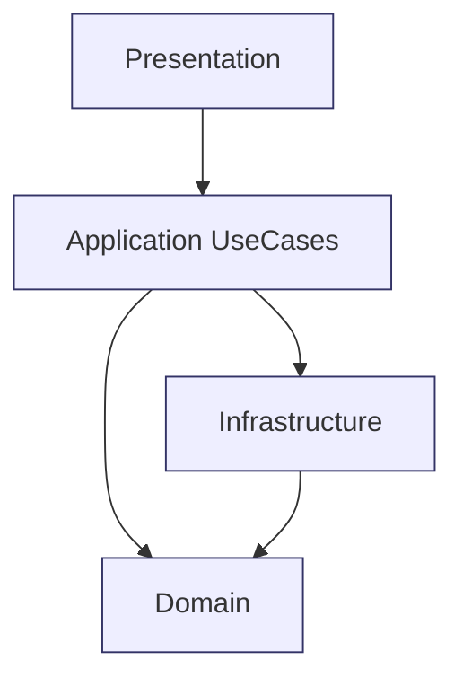
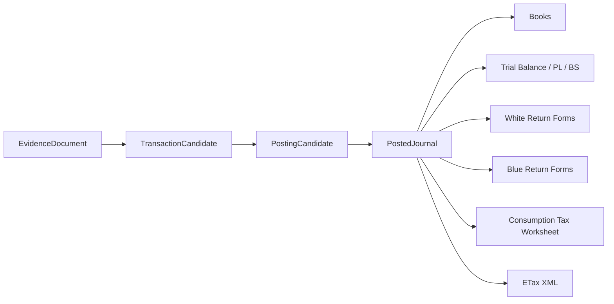
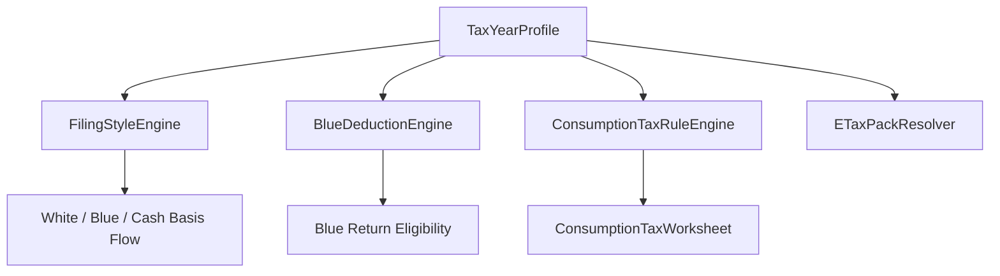
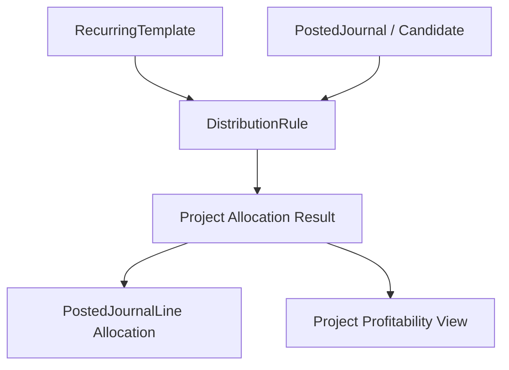

# ProjectProfit 外注委託用 超詳細仕様書
## 0から再構築する際の委託先向け 要件定義・12週間実装スプリント計画・ディレクトリ構成・命名規則・責務分離図

作成日: 2026-03-01  
対象プロダクト: **ProjectProfit**  
対象方式: **新規再構築（0から作る前提）**  
想定委託先: iOS 開発会社 / 個人受託チーム / 小規模開発会社 / 会計・税務 SaaS 受託経験ありのチーム

---

# 1. 本書の目的

この文書は、ProjectProfit を **外注先へ委託する際の完全な依頼仕様書** である。  
目的は次の 5 つ。

1. **手戻りを防ぐ**  
2. **要件漏れを防ぐ**  
3. **税務・会計・帳簿・証憑保存・プロジェクト管理を一体で実装させる**  
4. **12週間の実装スプリントで、どこまでを何週目で作るかを明確化する**  
5. **ディレクトリ構成・命名規則・責務分離を先に固定し、実装品質を均一化する**

この文書は、外注先との初回商談、提案依頼、要件合意、見積、着手、週次レビュー、検収までを一貫して使うことを前提としている。

---

# 2. 最重要前提（絶対に変えてはいけないもの）

外注先に対し、最初に明示するべきことは以下。

## 2.1 プロダクトコンセプト

本アプリは、以下の思想を**絶対に維持**する。

- 個人事業主向けであること
- プロジェクトごとに管理できること
- 会計処理と税務処理をノーストレス化すること
- AI を使う場合は **オンデバイス限定** であること
- 青色申告 / 白色申告 / インボイス / 消費税 / e-Tax を見据えた完成形にすること
- 定期取引の該当月自動分配、単月の全プロジェクトへの自動分配、ユーザー勘定科目追加、ジャンル追加などの**高い汎用性**を持つこと

## 2.2 変えてよいもの

以下は変更可能。

- UI デザイン
- 画面導線
- View / ViewModel / Repository の構成
- 保存形式
- 内部のモデル分割
- Export 実装
- OCR 実装の責務分離
- Ledger サブシステムの扱い

## 2.3 変えてはいけないもの

以下は変更不可。

- 「プロジェクトごとに管理する」という主概念
- 証憑から自動化したいという思想
- 個人事業主向けとしての軽さ
- ノーストレス化を最優先にする方針
- AI をクラウド送信しない方針
- 青色/白色の書類作成までを視野に入れる方針

---

# 3. 受託開発の前提条件（委託先に必ず伝えるべき契約前提）

## 3.1 開発方式

- 開発方式は **12週間固定スプリント** を前提とする
- 要件変更は完全禁止ではないが、**Change Request 制度** でのみ受ける
- 各スプリント終了時に、
  - デモ
  - ソース提出
  - テスト結果提出
  - 既知不具合一覧提出
  - 次週リスク提出
  を義務付ける

## 3.2 提出物の原則

毎週提出必須。

- 実装済みコード
- 単体テスト
- 変更点一覧
- 未実装一覧
- 設計差分
- DB/モデル差分
- UI 差分
- 次週予定
- ブロッカー

## 3.3 検収の原則

検収条件は「画面が見えること」ではなく、以下を全部満たすこと。

- ソースコード一式が提出される
- ビルド可能である
- テストが通る
- 指定した受け入れ基準を満たす
- コードレビューに耐える
- 命名規則・責務分離規則を守る
- ドキュメントが更新されている

## 3.4 外注先への禁止事項

以下は禁止とする。

- 仕様が曖昧なまま勝手に設計を簡略化すること
- 税務要件を「後で入れられる設計」に逃がすこと
- OCR/AI のために証憑データを外部 AI API へ送ること
- Ledger などの二重正本を温存すること
- XML 提出対象帳票を PDF 出力で代替したつもりになること
- 一時しのぎの if 文で税制差分を吸収すること
- 依存関係が逆転した巨大 `DataStore` を再生産すること
- テストなしでフォームや税額計算を実装すること

---

# 4. プロダクトスコープ（委託先に渡す最終完成像）

## 4.1 本プロダクトが目指す状態

ProjectProfit は、次の 1 本の流れを端末内中心で完結させるアプリである。

**証憑取込 → OCR/抽出 → 取引候補生成 → 仕訳候補生成 → 承認 → 帳簿生成 → 月締め → 年締め → 収支内訳書 / 青色申告決算書 / 消費税集計表 / e-Tax XML**

## 4.2 スコープ内

### 必須
- 事業者情報管理
- 年分プロフィール管理
- プロジェクト管理
- 証憑取込（カメラ/写真/PDF/共有）
- オンデバイス OCR
- 候補仕訳作成
- 確定仕訳
- 総勘定元帳、仕訳帳、現金出納帳、預金出納帳、経費帳、売掛帳、買掛帳、固定資産台帳、棚卸台帳、白色簡易帳簿
- プロジェクト別損益
- 定期取引
- 定期取引の該当月自動分配
- 単月の全プロジェクト自動分配
- ユーザー勘定科目追加
- ジャンル追加
- 青色/白色帳票生成
- 消費税集計表
- e-Tax XML 生成
- 年度ロック
- バックアップ
- 監査ログ

### 強く推奨
- CSV 明細インポート
- 銀行/カード明細照合
- 取引先マスタ
- 自動ルール学習（ローカルのみ）
- 業種プリセット

## 4.3 スコープ外（初期 12 週間では作らない）

- 法人税対応
- 給与計算本体
- ネットバンキング API 直接連携
- クラウド同期
- マルチユーザー権限管理の本格対応
- Web 管理画面
- Android 同時対応
- OCR 学習のクラウド最適化
- 顧客向け請求書発行 SaaS のフル機能

---

# 5. 税務・制度上の固定前提（設計に埋め込む前提）

> 外注先へは「制度は毎年変わるので、固定値ではなく年分パックで持つこと」と必ず指示する。

## 5.1 青色申告
- 青色申告特別控除は 55 万円、一定要件を満たす場合は 65 万円、簡易な場合は 10 万円である
- 65 万円控除は e-Tax または優良な電子帳簿要件と関係する
- 現金主義の特例では通常の 55/65 の整理と UI が分かれるため、通常青色と別フローで持つ必要がある citeturn0search0turn0search3

## 5.2 白色申告
- 白色でも記帳義務・保存義務があり、収支内訳書を作る必要がある
- 収支内訳書の記入要素は 1 ページの収支本体だけでなく 2 ページの明細も必要である citeturn0search4

## 5.3 インボイスと消費税
- 適格請求書の記載事項、保存期間 7 年、税率ごとの区分経理、少額特例、80%/50% 経過措置、2割特例がある
- 消費税額の端数処理は請求書単位・税率ごと 1 回である citeturn0search5turn0search2turn0search10

## 5.4 電子帳簿保存 / 電子取引保存
- 検索機能（日時/金額/取引先）
- 訂正削除履歴
- 帳簿間相互関連
が必要になるため、最初から Evidence/Audit モデルに組み込むこと citeturn0search5

## 5.5 e-Tax
- 収支内訳書、青色申告決算書は PDF ではなく XML 提出対象であり、仕様書は年ごとに更新されるため TaxYearPack が必要である citeturn11search2turn0search17

## 5.6 添付様式のページ構成
- 青色申告決算書は損益計算書、月別売上・給料賃金、減価償却等、貸借対照表を含む 4 ページ構成（控え含め 8 ページ）
- 収支内訳書は本体ページに加え、売上先・仕入先・減価償却・地代家賃・利子割引料の明細ページを持つ fileciteturn0file1 fileciteturn0file0

---

# 6. 外注先に渡すべき成果物定義

## 6.1 必須成果物

### 設計成果物
- 要件定義書
- 画面一覧
- 画面遷移図
- ドメインモデル図
- 永続化モデル図
- 税務ルール仕様
- 帳簿フォーマット仕様
- 帳票フィールド仕様
- TaxYearPack 仕様
- 命名規則表
- 責務分離図
- スプリントごとの成果物一覧

### 実装成果物
- iOS ソースコード一式
- テストコード一式
- サンプルデータ
- ビルド手順
- 依存ライブラリ一覧
- コード生成スクリプト
- e-Tax pack 生成スクリプト

### 検収成果物
- テスト実行結果
- 既知不具合一覧
- 残タスク一覧
- 受け入れテスト証跡
- 主要帳簿の PDF サンプル
- 青色/白色の帳票サンプル
- XML サンプル

## 6.2 各スプリントで求めるもの

各週、最低でも次を提出させる。

- ソースコード
- 実装済み一覧
- 未実装一覧
- 不具合一覧
- テスト一覧
- スクリーンショット or 動画
- 次週のリスク
- 仕様確認が必要な論点

---

# 7. 受託先向け実装原則

## 7.1 1つの原則

**証憑 → 取引候補 → 仕訳候補 → 確定仕訳 → 帳簿 → 帳票**

これ以外の正本ルートは作らない。

## 7.2 データ正本の原則

### 正本
- EvidenceDocument
- TransactionCandidate
- PostingCandidate
- PostedJournal

### 派生
- 帳簿
- 試算表
- 損益計算書
- 貸借対照表
- 収支内訳書
- 青色申告決算書
- 消費税集計表
- PDF/CSV/Excel/XML

## 7.3 実装禁止

- 帳簿自体を正本化すること
- 帳簿専用 DB を別に持つこと
- UI 用 DTO を正本として永続化すること
- 仕訳確定前に会計帳簿へ直接反映すること

---

# 8. ディレクトリ構成（委託先に固定で指示する構成）

```text
ProjectProfit/
  App/
    Bootstrap/
    Routing/
    Environment/

  Domain/
    Business/
    Tax/
    Evidence/
    Accounts/
    Counterparty/
    Projects/
    Posting/
    Allocation/
    Books/
    Forms/
    Automation/
    Audit/

  Application/
    UseCases/
      Intake/
      Posting/
      Reconciliation/
      Distribution/
      Recurring/
      Books/
      Filing/
      Closing/
      Migration/

  Infrastructure/
    Persistence/
      SwiftData/
      Repositories/
      Migration/
    OCR/
    LocalAI/
    Files/
    Export/
      PDF/
      CSV/
      Excel/
      XML/
    TaxYearPacks/
    Validation/
    Logging/
    Security/

  Presentation/
    Home/
    Inbox/
    Projects/
    Transactions/
    Journals/
    Books/
    Filing/
    Settings/
    Shared/
      Components/
      Themes/
      Formatters/

  Resources/
    TaxYearPacks/
      2025/
      2026/
      2027/
    Dictionaries/
    Templates/
    SampleData/
    PreviewFixtures/

  Tests/
    Unit/
    Integration/
    Snapshot/
    Golden/
    Migration/
    Performance/
```

## 8.1 ディレクトリ分離ルール

- `Domain/` は **純粋モデル・enum・policy** のみ。UI や DB を知らない
- `Application/` は **ユースケース**。ドメインをどう組み合わせるかだけを持つ
- `Infrastructure/` は **保存・OCR・出力・ローカル AI・Pack Loader** など外界との接続
- `Presentation/` は **SwiftUI / ViewModel / Formatter / 画面状態**
- `Resources/` は **TaxYearPack / テンプレート / 辞書 / フィクスチャ**
- `Tests/` は **責務ごとに分離**

## 8.2 絶対禁止の構成

- `DataStore+Something.swift` が増殖する構成
- `Views/ContentView.swift` に大量の struct View が同居する構成
- `Models.swift` に全モデルを詰め込む構成
- `Ledger` と `Accounting` のような二重世界を永続化レベルで持つ構成
- 税年別ルールをコードの `if year == 2026` で散らす構成

---

# 9. 命名規則（委託先に強制するルール）

## 9.1 全体原則

- Swift 型名: `UpperCamelCase`
- プロパティ・関数: `lowerCamelCase`
- 定数: `lowerCamelCase` を原則、グローバル固定値だけ `UPPER_SNAKE_CASE` 可
- enum case: `lowerCamelCase`
- 画面ファイル: `ScreenNameView.swift`
- ViewModel: `ScreenNameViewModel.swift`
- Repository: `EntityNameRepository.swift`
- UseCase: `VerbNounUseCase.swift`
- Service: ドメインルールでなく外部連携・補助的責務だけに使う
- Builder: フォームや export など**生成物を組み立てる責務**だけに使う
- Engine: ルール計算、最適化、判断ロジックに限定する

## 9.2 禁止命名

- `DataStore` のような巨大曖昧名を新規追加しない
- `Manager`, `Util`, `Helper` の乱用禁止
- `FinalService`, `NewService`, `BetterService` のような時間依存命名禁止
- `Temp`, `Tmp`, `v2`, `Fixed` を本番コードに残さない
- `LedgerBridge` のような暫定名を恒久コードにしない

## 9.3 モデル命名規則

### 良い例
- `BusinessProfile`
- `TaxYearProfile`
- `EvidenceDocument`
- `EvidenceVersion`
- `PostingCandidate`
- `PostedJournal`
- `DistributionRule`
- `ConsumptionTaxWorksheet`
- `BlueReturnFormPackage`
- `WhiteReturnFormPackage`

### 悪い例
- `PPAccountingProfile`
- `PPDocumentRecord`
- `Models`
- `TaxHelper`
- `AccountingManager`

## 9.4 ファイル命名規則

### View
- `HomeDashboardView.swift`
- `EvidenceInboxView.swift`
- `PostingReviewView.swift`
- `ProjectDetailView.swift`
- `ConsumptionTaxWorksheetView.swift`

### ViewModel
- `HomeDashboardViewModel.swift`
- `EvidenceInboxViewModel.swift`
- `PostingReviewViewModel.swift`

### UseCase
- `ImportEvidenceUseCase.swift`
- `ApprovePostingCandidateUseCase.swift`
- `GenerateMonthlyDistributionUseCase.swift`
- `CloseTaxYearUseCase.swift`

### Repository
- `EvidenceRepository.swift`
- `PostedJournalRepository.swift`
- `CounterpartyRepository.swift`

### Engine
- `BlueDeductionEngine.swift`
- `ConsumptionTaxRuleEngine.swift`
- `DistributionRuleEngine.swift`
- `PostingDecisionEngine.swift`

### Builder
- `BlueReturnFormBuilder.swift`
- `WhiteReturnFormBuilder.swift`
- `GeneralLedgerExportBuilder.swift`

---

# 10. 責務分離図（委託先に固定で渡す図）

## 10.1 レイヤ責務図



### 説明
- `Presentation` は UI 表示とユーザー操作だけ
- `Application` は業務フローをまとめる
- `Domain` は業務ルールそのもの
- `Infrastructure` は保存・OCR・出力・pack 読み込みなど外部接続だけ

## 10.2 正本と派生の責務図



### 説明
- `EvidenceDocument` と `PostedJournal` の間が正本
- 帳簿・帳票・XML は全部派生
- 帳簿画面から直接正本を書き換えない

## 10.3 税務責務図



### 説明
- `TaxYearProfile` が全税務状態の起点
- 税務は UI の if 文ではなく Engine で分岐

## 10.4 配賦責務図



### 説明
- 配賦は transaction のおまけではない
- `DistributionRule` が recurring と月次バッチの双方を支える

---

# 11. 委託先に求める役割分担

## 11.1 推奨チーム構成

最低限、以下の役割を置く。

- **PM / 要件責任者**: 1 名
- **iOS リードエンジニア**: 1 名
- **iOS エンジニア**: 1〜2 名
- **テスト責任者 / QA**: 1 名
- **会計・税務レビュー担当**: スポットでも可
- **UI/UX デザイナー**: 必要に応じて 0.5〜1 名

## 11.2 責務分担

### 発注側
- 最終意思決定
- 税務方針の確認
- 帳簿フォーマットの最終承認
- 週次レビュー参加
- 変更要望の優先度付け

### 受託側
- 設計提案
- 実装
- テスト
- 仕様差分報告
- 技術負債報告
- 移行計画提示
- リスク提示

### 税務レビュー担当
- 青色/白色帳票の項目整合
- インボイス・消費税特例の実装レビュー
- 帳簿表示の実務妥当性確認

---

# 12. 手戻り防止のための委託ルール

## 12.1 Change Request ルール

仕様追加・変更は、以下の書式でのみ受ける。

- 変更タイトル
- 背景
- 変更内容
- 影響モジュール
- 影響画面
- 影響帳簿
- 影響帳票
- 影響データ移行
- 工数見積
- リスク
- 優先度
- 今スプリントに入れるか / 後ろへ回すか

## 12.2 仕様未確定項目の扱い

委託先は、未確定事項を実装前に必ず `Open Questions` として提出する。

### Open Questions 例
- 白色簡易帳簿の入力体験をどこまで簡略化するか
- 銀行CSV取り込みを初期 12 週でどこまで入れるか
- 取引先マスタの初期項目をどこまで必須にするか
- 源泉徴収を初期スコープに含めるか

## 12.3 デモ必須ルール

各スプリントの終わりに必ず以下を実演させる。

- 実際のデータ入力
- 実際の証憑取込
- 帳簿生成
- 帳票プレビュー
- エラーケース
- undo / reversal / correction

## 12.4 週次レポート必須フォーマット

- 今週やったこと
- 完了したチケット
- まだ終わっていないこと
- バグ件数
- 技術負債
- 来週の予定
- 発注側の意思決定が必要なこと

---

# 13. 12週間実装スプリント計画

以下は、0から作る場合の **固定 12 週間計画**。  
委託先へは「この粒度で毎週レビューする」と明示する。

---

## Sprint 1（Week 1）
## 目的: キックオフ、要件凍結、設計土台、現行資産棚卸

### 実装タスク
- リポジトリ初期セットアップ
- コーディング規約導入
- CI 初期構築
- ディレクトリ構成固定
- 命名規則固定
- Domain / Application / Infrastructure / Presentation の空構成作成
- 現行要件・現行帳簿・現行帳票の棚卸
- Open Questions の初版作成
- 受け入れ基準の初版作成

### 委託先提出物
- 開発計画書
- アーキテクチャ案
- 画面一覧案
- ドメインモデル案
- リスク一覧
- Open Questions 一覧

### 発注側レビュー事項
- コンセプト逸脱がないか
- プロジェクト軸が主役のままか
- AI オンデバイス限定が明記されているか
- 税務要件が先送りされていないか

### Sprint 1 完了条件
- レイヤ責務図が合意済み
- 命名規則が合意済み
- ディレクトリ構成が合意済み
- 12週計画が確定している

---

## Sprint 2（Week 2）
## 目的: Canonical Domain の実装開始

### 実装タスク
- `BusinessProfile`
- `TaxYearProfile`
- `Project`
- `Counterparty`
- `Genre`
- `Account`
- `TaxCode`
- `DistributionRule`
- `AuditEvent`
- `YearLock`
- Domain enum 群実装

### 受け入れ基準
- 旧 `PPAccountingProfile` 相当の情報が新モデルで表現できる
- 青色/白色/現金主義/課税/免税/2割特例状態が列挙型で持てる
- プロジェクト・ジャンル・取引先が独立モデルとして定義される

### 提出物
- モデル一覧
- 型定義一覧
- JSON / SwiftData / DB マッピング方針
- 単体テスト

---

## Sprint 3（Week 3）
## 目的: 正本系列の確立

### 実装タスク
- `EvidenceDocument`
- `EvidenceVersion`
- `TransactionCandidate`
- `PostingCandidate`
- `PostedJournal`
- `PostedJournalLine`
- `PostingApproval`
- Repository 初版
- FileStore 初版
- SearchIndex 初版

### 受け入れ基準
- 帳簿が正本ではなく、Evidence/Journal が正本であることがコード上明確
- 証憑と仕訳がリンクできる
- Version 履歴のための器がある

### デモ
- Evidence を 1 件作成して PostedJournal へ至るまでの最小経路を見せる

---

## Sprint 4（Week 4）
## 目的: TaxYearPack と税務状態マシン

### 実装タスク
- `TaxYearPackLoader`
- `TaxYearPackResolver`
- `FilingStyleEngine`
- `BlueDeductionEngine`
- `WhiteBookkeepingRuleEngine`
- `PurchaseCreditMethod`
- 税年ごとの差分持ち方の実装
- Tax pack 用 JSON スキーマ策定

### 受け入れ基準
- 2025 と 2026 の差分を pack で吸収できる構造
- 65/55/10、白色、現金主義の分岐が UI if 文ではなく engine で判定される

### 提出物
- pack 仕様書
- pack 例（2025 / 2026）
- テスト

---

## Sprint 5（Week 5）
## 目的: 証憑取込基盤（オンデバイス限定）

### 実装タスク
- `DocumentImportService`
- `OnDeviceOCRService`
- `EvidenceClassifier`
- `EvidenceSearchIndexBuilder`
- カメラ/写真/PDF/共有の import 導線
- OCR テキスト抽出
- T番号抽出
- 税率別ブロック抽出
- 信頼度スコア
- 重複検知初版

### 受け入れ基準
- 外部 AI 送信なし
- 取込チャネルが複数ある
- 証憑が台帳へ蓄積される
- T番号抽出が機能する

### デモ
- PDF / 画像から証憑を取り込み、抽出結果を見せる

---

## Sprint 6（Week 6）
## 目的: 自動仕訳候補、承認フロー、配賦ルール基盤

### 実装タスク
- `PostingEngine`
- `PostingDecisionEngine`
- `DistributionRuleEngine`
- `RecurringTemplate`
- recurring 自動生成初版
- 該当月自動配賦初版
- 単月の全プロジェクト配賦 batch 初版
- User Rule Engine 初版

### 受け入れ基準
- 証憑から posting candidate が作れる
- 承認前に review queue へ入る
- equal 配賦と固定比率配賦ができる
- 全プロジェクト配賦バッチの preview がある

### デモ
- 1 証憑から複数プロジェクト配賦を含む候補が生成される
- recurring から月次分配が作られる

---

## Sprint 7（Week 7）
## 目的: 消費税ルールエンジンと worksheet

### 実装タスク
- `ConsumptionTaxRuleEngine`
- `ConsumptionTaxWorksheet`
- 標準税率/軽減税率集計
- 80%/50% 経過措置
- 少額特例
- 2割特例
- 端数処理ポリシー
- 税込/税抜整流化

### 受け入れ基準
- ユーザー添付の消費税集計表レベルの粒度で集計できる
- 80%/50%/少額特例/2割特例が誤判定しない
- 税率別・制度別集計が追える

### デモ
- 10% / 8% 混在証憑から worksheet を生成する
- 80% と 50% の切替日をまたぐテストを見せる

---

## Sprint 8（Week 8）
## 目的: 帳簿エンジン完成

### 実装タスク
- `BookProjectionEngine`
- `BookSpecRegistry`
- 仕訳帳
- 総勘定元帳
- 現金出納帳
- 預金出納帳
- 売掛帳
- 買掛帳
- 経費帳
- プロジェクト別補助元帳
- BookValidation 初版

### 受け入れ基準
- すべて `PostedJournal` から派生生成される
- 帳簿が同じ列規約に従う
- PDF/CSV/Excel 前提の spec が固定されている

### デモ
- 同じ journal から複数帳簿が生成される
- プロジェクト別補助元帳が表示できる

---

## Sprint 9（Week 9）
## 目的: 固定資産・棚卸・決算整理

### 実装タスク
- `FixedAssetLedger`
- `DepreciationSchedule`
- `InventoryLedger`
- `InventoryRollforward`
- `YearEndAdjustmentEngine`
- 決算整理仕訳
- 期首繰越

### 受け入れ基準
- 減価償却費計算と帳簿連動ができる
- 棚卸高から売上原価に繋がる
- 年次繰越を再現できる

### デモ
- 固定資産 1 件取得 → 償却 → 帳票反映
- 在庫データ → 期末棚卸 → 売上原価反映

---

## Sprint 10（Week 10）
## 目的: 白色 / 青色帳票、e-Tax XML

### 実装タスク
- `WhiteReturnFormBuilder`
- `BlueReturnFormBuilder`
- `ETaxExportService`
- `FormValidationService`
- XML/PDF 役割分離
- 収支内訳書 1/2 ページ
- 青色申告決算書 1/2/3/4 ページ
- 青色現金主義用フロー

### 受け入れ基準
- 添付様式の必要ページに対応できる
- XML と PDF の責務が分離されている
- 主要フィールド欠落が preflight で検出できる

### デモ
- 青色申告決算書のページごとの preview
- 収支内訳書の preview
- XML 出力サンプル

---

## Sprint 11（Week 11）
## 目的: UI/UX 再構築と通しフロー

### 実装タスク
- Home Dashboard
- Evidence Inbox
- Posting Review
- Projects Workspace
- Books Hub
- Filing Hub
- Settings/Master 管理
- Month close / Year close wizard
- Error handling / recovery UI

### 受け入れ基準
- 証憑投入 → 承認 → 帳簿 → 帳票まで通る
- recurring と配賦の操作が実用的
- 初見ユーザーでも迷いにくい

### デモ
- 1ユーザーで 1 年分を流す通しデモ

---

## Sprint 12（Week 12）
## 目的: 移行・総合試験・検収準備

### 実装タスク
- Migration Runner
- Migration Dry Run UI
- Snapshot backup/restore
- Golden tests
- Performance tests
- XML validation
- 既知不具合整理
- 受け入れテスト
- リリースチェックリスト

### 受け入れ基準
- 旧データ移行の dry run が通る
- 主要 golden tests が通る
- 既知不具合一覧が明確
- 検収資料が揃う

### 最終提出物
- ソース一式
- ドキュメント一式
- テスト一式
- sample data
- build 手順
- release 手順
- migration 手順
- 運用 runbook

---

# 14. 外注先に要求する画面一覧

## 14.1 必須画面
- Home Dashboard
- Evidence Inbox
- Evidence Detail / OCR Correction
- Transaction Candidate List
- Posting Review
- Manual Journal Editor
- Projects List
- Project Detail
- Recurring Templates
- Monthly Distribution Batch
- Accounts Master
- Counterparty Master
- Genre Master
- Books Hub
- General Journal
- General Ledger
- Cash Book
- Bank Book
- Expense Book
- AR Book
- AP Book
- Fixed Asset Ledger
- Inventory Ledger
- Consumption Tax Worksheet
- White Return Preview
- Blue Return Preview
- Filing Hub
- ETax Export Screen
- Month Close Wizard
- Year Close Wizard
- Settings / Tax Year Profile
- Backup / Restore

## 14.2 画面ごとに外注先へ要求する詳細項目

各画面について、最低限次を仕様書に起こさせる。

- 画面目的
- 主要 actor
- 表示データ
- 主操作
- 主要状態（idle/loading/error/empty/review_required/locked など）
- 権限 / ロック制御
- バリデーション
- 遷移先
- エラー時の振る舞い
- テスト観点

---

# 15. 外注先へ要求する API / UseCase 粒度

> iOS 単体アプリでも、内部的に API 的な UseCase 設計を要求する。

## 15.1 必須 UseCase

### Intake
- ImportEvidenceUseCase
- ReprocessEvidenceUseCase
- CorrectExtractedFieldsUseCase
- DetectDuplicateEvidenceUseCase

### Posting
- BuildPostingCandidateUseCase
- ApprovePostingCandidateUseCase
- RejectPostingCandidateUseCase
- PostJournalUseCase
- ReverseJournalUseCase

### Distribution
- PreviewMonthlyDistributionUseCase
- ApplyMonthlyDistributionUseCase
- GenerateRecurringTransactionsUseCase

### Books
- RebuildBooksUseCase
- GenerateGeneralLedgerUseCase
- GenerateCashBookUseCase
- GenerateProjectSubLedgerUseCase

### Filing
- BuildWhiteReturnUseCase
- BuildBlueReturnUseCase
- BuildConsumptionTaxWorksheetUseCase
- ValidateFilingPackageUseCase
- ExportETaxXMLUseCase

### Closing
- CloseMonthUseCase
- CloseTaxYearUseCase
- ReopenTaxYearUseCase

### Migration / Backup
- RunMigrationDryRunUseCase
- ExecuteMigrationUseCase
- CreateBackupUseCase
- RestoreBackupUseCase

---

# 16. 非機能要件（外注先に明示する品質条件）

## 16.1 性能
- 証憑 1,000 件検索が p95 で 1.5 秒以内
- 年度帳簿再生成が 5 秒以内（標準端末想定）
- OCR 1 枚処理が UX 上許容される時間で返ること（非同期可）
- 1 年分の仕訳・帳簿・帳票がアプリクラッシュなく再生成できること

## 16.2 安定性
- import/reprocess/export は idempotent
- recurring は二重生成しない
- year lock 後に journal が直接壊れない
- migration 中断時に復旧可能

## 16.3 セキュリティ
- 証憑ファイルは file protection を使う
- 重要設定は Keychain or protected store を使う
- AI は外部送信しない
- XML/PDF 生成時に危険文字を sanitize する

## 16.4 可観測性
- audit log
- import log
- OCR log
- posting decision log
- tax rule decision log
- export log
- migration log

---

# 17. 委託先に提出させるテスト一覧

## 17.1 Unit Tests
- 青色 65/55/10
- 白色
- 青色現金主義
- 少額特例
- 80% 経過措置
- 50% 経過措置
- 2割特例
- 税込/税抜
- 端数処理
- recurring 生成
- 配賦ルール
- Evidence search index
- T番号抽出

## 17.2 Integration Tests
- 証憑 → candidate → posted journal → books
- recurring → monthly distribution → books
- fixed asset → depreciation → return forms
- inventory → cogs → return forms
- worksheet → XML export

## 17.3 Snapshot / Golden Tests
- 仕訳帳
- 総勘定元帳
- 現金出納帳
- 預金出納帳
- 経費帳
- 白色簡易帳簿
- 消費税集計表
- 収支内訳書
- 青色申告決算書

## 17.4 Migration Tests
- 旧 profile → 新 profile
- 旧 transaction → posted journal
- 旧 document → evidence
- 旧 ledger → projection

---

# 18. 検収チェックリスト

## 18.1 機能
- [ ] プロジェクトごとの管理が主役として残っている
- [ ] 証憑起点のフローがある
- [ ] AI はオンデバイス限定である
- [ ] 定期取引の該当月自動分配ができる
- [ ] 単月の全プロジェクト自動分配ができる
- [ ] ユーザー勘定科目追加ができる
- [ ] ジャンル追加ができる
- [ ] 帳簿がすべて派生生成できる
- [ ] 白色/青色帳票が出る
- [ ] 消費税集計表が出る
- [ ] XML が出る

## 18.2 品質
- [ ] 命名規則が守られている
- [ ] 責務分離が守られている
- [ ] `Manager`, `Util`, `Helper` が乱立していない
- [ ] `DataStore+xx` の肥大化が再発していない
- [ ] 旧 ledger 正本が温存されていない
- [ ] テストが揃っている

## 18.3 ドキュメント
- [ ] ディレクトリ構成図
- [ ] ドメインモデル図
- [ ] 税務ルール仕様
- [ ] 帳簿仕様
- [ ] 帳票仕様
- [ ] Migration 手順
- [ ] Release 手順
- [ ] Runbook

---

# 19. 委託先に送る依頼文テンプレート（そのまま使える文面）

以下を外注先へ送ると、認識ズレが減る。

---

## 依頼文テンプレート

ProjectProfit は、個人事業主向けのプロジェクト別会計アプリです。  
今回、既存コードを前提にした継ぎ足しではなく、**0からの再構築前提** で委託したいです。  
ただし、以下のコンセプトは絶対に維持してください。

- 個人事業主向け
- プロジェクトごとの管理
- 会計・税務のノーストレス化
- AI はオンデバイス限定

今回お願いしたいのは、

- 証憑起点の会計システム
- 青色/白色/消費税/e-Taxまで見据えた構成
- 定期取引の該当月自動分配
- 単月の全プロジェクトへの自動分配
- ユーザー勘定科目追加、ジャンル追加などの高い汎用性
- 帳簿フォーマットの完成度

を満たす設計と実装です。

添付の仕様書では、

- 12週間のスプリント計画
- ディレクトリ構成
- 命名規則
- 責務分離
- 受け入れ基準
- 検収条件

まで固定しています。  
まずはこの仕様書に沿って、

1. 実現可能性
2. 想定体制
3. リスク
4. 週次進行案
5. 疑義一覧

を提出してください。

また、要件が曖昧なまま勝手に簡略化することは不可とします。  
変更は Change Request 制度でのみ受けます。

---

# 20. 最終結論

外注で失敗する最大の原因は、

- 何を作るかは書いてあるが、**何を作ってはいけないか** が書かれていない
- 週ごとの到達点が曖昧
- 帳簿や税務が後回し
- 命名規則・責務分離が固定されていない
- 検収が「見た目」で流れる

ことです。

この文書は、それを防ぐために作っています。

ProjectProfit を本当に完成品にするためには、

- 証憑
- 会計
- 消費税
- 青色/白色帳票
- プロジェクト別管理
- 自動配賦
- 年度ロック
- e-Tax XML

を **最初から 1 本の設計で持つこと** が必要です。

委託先には、

> 「会計アプリを作る」のではなく、  
> 「個人事業主が証憑から申告書類までノーストレスで使える、プロジェクト別管理型の会計システムを作る」

という理解をさせることが重要です。

---

# 21. 参考資料

## 国税庁 / e-Tax
- No.2072 青色申告特別控除  
  https://www.nta.go.jp/taxes/shiraberu/taxanswer/shotoku/2072.htm
- No.2070 青色申告制度  
  https://www.nta.go.jp/taxes/shiraberu/taxanswer/shotoku/2070.htm
- 令和7年分 収支内訳書（一般用）の書き方  
  https://www.nta.go.jp/taxes/shiraberu/shinkoku/tebiki/2025/pdf/034.pdf
- 適格請求書等保存方式（インボイス制度）の手引き  
  https://www.nta.go.jp/taxes/shiraberu/zeimokubetsu/shohi/keigenzeiritsu/pdf/0022009-090.pdf
- 2割特例  
  https://www.nta.go.jp/publication/pamph/shohi/kaisei/202304/01.htm
- e-Tax 仕様書一覧  
  https://www.e-tax.nta.go.jp/shiyo/shiyo3.htm
- e-Tax 仕様書更新情報  
  https://www.e-tax.nta.go.jp/shiyo/shiyo2.htm

## ユーザー添付資料
- 青色申告決算書 PDF
- 収支内訳書 PDF
- 消費税集計表 PNG

